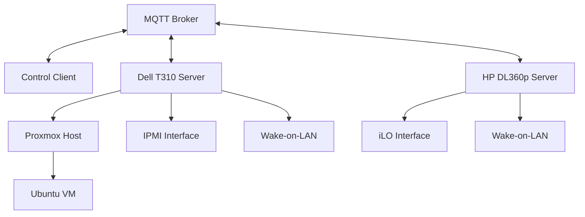

# Dell & HP Server Remote Management System - Development Guide

## Project Overview

This project provides automated remote boot and shutdown capabilities for Dell T310 (IPMI) and HP DL360p (iLO) servers, controlled via MQTT protocol. The system supports multiple server types with different management interfaces.

---

## System Architecture



### Components

1. **Dell T310 Server** - Physical server with IPMI remote management
2. **HP DL360p Server** - Physical server with iLO remote management
3. **Proxmox Host** - Virtualization platform (optional, for Dell T310)
4. **Ubuntu VM** - Virtual machine for running management scripts (optional)
5. **MQTT Broker** - Message broker for remote commands
6. **Control Scripts** - Python scripts for automation

---

## Hardware Requirements

### Dell T310 Capabilities

- **IPMI** - Intelligent Platform Management Interface for remote management
- **Wake-on-LAN (WoL)** - Network-based power-on capability
- **Network Interface** - Dedicated management network port (or shared with primary network)

### HP DL360p Capabilities

- **iLO (Integrated Lights-Out)** - HP's remote management interface
- **Wake-on-LAN (WoL)** - Network-based power-on capability
- **Dedicated iLO Network Port** - Separate management network interface
- **Advanced Features** - Remote console, virtual media, health monitoring

### Network Configuration

- Static IP address for server management interface
- MQTT broker accessible from both control client and server
- Port forwarding if accessing from external network:
  - IPMI: Port 623 (UDP)
  - MQTT: Port 1883 (TCP) or 8883 (TLS)

---

## Software Stack

### Core Technologies

| Component | Technology | Purpose |
|-----------|-----------|---------|
| **MQTT Broker** | Mosquitto | Message broker for commands |
| **MQTT Client** | Paho-MQTT (Python) | MQTT communication library |
| **Dell T310 Control** | ipmitool | IPMI hardware power management |
| **HP DL360p Control** | python-hpilo | iLO hardware power management |
| **Wake-on-LAN** | wakeonlan / etherwake | Remote boot functionality |
| **OS** | Ubuntu 22.04+ | VM operating system |
| **Proxmox** | Proxmox VE 7.x+ | Virtualization platform (optional) |

---

## Project Structure

```
ServerBootShutdownMangement/
├── DEVELOPMENT_GUIDE.md          # This file
├── README.md                      # Project overview and quick start
├── requirements.txt               # Python dependencies
├── config/
│   ├── mqtt_config.yaml          # MQTT broker settings
│   ├── server_config.yaml        # Server hardware settings
│   └── .env.example              # Environment variables template
├── scripts/
│   ├── boot/
│   │   ├── mqtt_boot_listener.py # MQTT listener for boot commands
│   │   ├── wol_boot.py           # Wake-on-LAN boot script
│   │   └── ipmi_boot.py          # IPMI-based boot script
│   ├── shutdown/
│   │   ├── mqtt_shutdown_listener.py # MQTT listener for shutdown
│   │   ├── graceful_shutdown.py  # Graceful VM and host shutdown
│   │   └── force_shutdown.py     # Emergency shutdown via IPMI
│   ├── status/
│   │   ├── health_monitor.py     # Server health monitoring
│   │   └── status_publisher.py   # Publish status to MQTT
│   └── utils/
│       ├── mqtt_client.py        # Reusable MQTT client wrapper
│       ├── ipmi_wrapper.py       # IPMI command wrapper
│       └── logger.py             # Logging configuration
├── systemd/
│   ├── mqtt-boot-listener.service
│   ├── mqtt-shutdown-listener.service
│   └── status-publisher.service
├── tests/
│   ├── test_mqtt_connection.py
│   ├── test_ipmi_commands.py
│   └── test_wol.py
└── docs/
    ├── SETUP.md                  # Initial setup instructions
    ├── MQTT_PROTOCOL.md          # MQTT message format specification
    └── TROUBLESHOOTING.md        # Common issues and solutions
```

---

## Development Phases

### Phase 1: Environment Setup ✓

**Objectives:**
- [ ] Configure Dell T310 IPMI interface
- [ ] Enable Wake-on-LAN in BIOS
- [ ] Install and configure MQTT broker (Mosquitto)
- [ ] Set up Ubuntu VM on Proxmox
- [ ] Install required tools and libraries

**Tasks:**

1. **Configure IPMI Interface**
   ```bash
   # Access BIOS/IPMI settings during boot (usually F2 or F10)
   # Navigate to: Integrated Devices > IPMI Settings
   # Enable IPMI over LAN
   # Set static IP for IPMI interface (recommended)
   # Note the IP address, username, and password
   
   # Test IPMI connectivity from another machine
   ipmitool -I lanplus -H <ipmi-ip> -U <username> -P <password> chassis status
   
   # If IPMI password needs to be set/changed via command line:
   ipmitool -I lanplus -H <ipmi-ip> -U <username> -P <old-password> user set password 2 <new-password>
   ```

2. **Configure HP DL360p iLO Interface**
   ```bash
   # Access iLO web interface via browser
   # Default URL: https://<ilo-ip>
   # Default username: Administrator
   # Default password: (check server label or documentation)
   
   # Configure iLO network settings:
   # 1. Login to iLO web interface
   # 2. Navigate to: Network > iLO Dedicated Network Port
   # 3. Set static IP address (recommended)
   # 4. Configure subnet mask and gateway
   # 5. Enable DHCP if preferred
   
   # Set/change iLO password:
   # 1. Navigate to: Administration > User Administration
   # 2. Select Administrator user
   # 3. Click "Edit" and set new password
   # 4. Note these credentials for later use
   
   # Test iLO connectivity using python-hpilo (after installation):
   python3 -c "import hpilo; ilo = hpilo.Ilo('<ilo-ip>', 'Administrator', '<password>'); print(ilo.get_host_power_status())"
   ```

3. **Install MQTT Broker**
   ```bash
   # On a dedicated server or VM
   sudo apt update
   sudo apt install mosquitto mosquitto-clients
   sudo systemctl enable mosquitto
   sudo systemctl start mosquitto
   ```

4. **Install Dependencies on Ubuntu VM**
   ```bash
   # Install system packages
   sudo apt install python3-pip ipmitool wakeonlan
   
   # Install Python packages
   pip3 install paho-mqtt pyyaml python-dotenv python-hpilo
   ```

---

### Phase 2: Core Script Development

**Objectives:**
- [ ] Implement MQTT client wrapper
- [ ] Create boot scripts (WoL + IPMI)
- [ ] Create shutdown scripts (graceful + force)
- [ ] Implement status monitoring
- [ ] Add comprehensive logging

#### 2.1 MQTT Client Wrapper

**File:** `scripts/utils/mqtt_client.py`

**Features:**
- Connection management with auto-reconnect
- TLS/SSL support
- QoS configuration
- Message validation
- Error handling

**Key Functions:**
```python
class MQTTClientWrapper:
    def __init__(self, config)
    def connect()
    def subscribe(topic, callback)
    def publish(topic, message)
    def disconnect()
```

#### 2.2 Boot Scripts

**File:** `scripts/boot/mqtt_boot_listener.py`

**MQTT Topic:** `dell/t310/command/boot`

**Message Format:**
```json
{
  "action": "boot",
  "method": "wol|ipmi",
  "timestamp": "2025-12-25T20:18:53+02:00",
  "request_id": "unique-id"
}
```

**Workflow:**
1. Listen for boot commands on MQTT topic
2. Validate message format and authentication
3. Execute appropriate boot method (WoL or IPMI)
4. Publish status update
5. Monitor boot progress
6. Confirm successful boot

#### 2.3 Shutdown Scripts

**File:** `scripts/shutdown/mqtt_shutdown_listener.py`

**MQTT Topic:** `dell/t310/command/shutdown`

**Message Format:**
```json
{
  "action": "shutdown",
  "type": "graceful|force",
  "timeout": 300,
  "timestamp": "2025-12-25T20:18:53+02:00",
  "request_id": "unique-id"
}
```

**Graceful Shutdown Workflow:**
1. Receive shutdown command
2. Notify all VMs to prepare for shutdown
3. Shutdown VMs gracefully (via Proxmox API)
4. Wait for VMs to stop (with timeout)
5. Shutdown Proxmox host
6. Publish final status before power off

**Force Shutdown Workflow:**
1. Receive force shutdown command
2. Use IPMI to immediately power off
3. Publish status (if possible)

#### 2.4 Status Monitoring

**File:** `scripts/status/status_publisher.py`

**MQTT Topic:** `dell/t310/status`

**Message Format:**
```json
{
  "server_state": "online|offline|booting|shutting_down",
  "uptime": 3600,
  "cpu_usage": 45.2,
  "memory_usage": 62.8,
  "vm_count": 3,
  "vms": [
    {"name": "ubuntu-vm", "status": "running", "cpu": 12.3, "memory": 2048}
  ],
  "timestamp": "2025-12-25T20:18:53+02:00"
}
```

**Publishing Interval:** Every 30 seconds (configurable)

---

### Phase 3: Configuration Management

**Objectives:**
- [ ] Create configuration file templates
- [ ] Implement environment variable support
- [ ] Add configuration validation
- [ ] Document all configuration options

#### 3.1 MQTT Configuration

**File:** `config/mqtt_config.yaml`

```yaml
mqtt:
  broker:
    host: "mqtt.example.com"
    port: 1883
    keepalive: 60
  
  authentication:
    username: "dell_t310"
    password: "${MQTT_PASSWORD}"  # From environment
  
  tls:
    enabled: false
    ca_certs: "/path/to/ca.crt"
    certfile: "/path/to/client.crt"
    keyfile: "/path/to/client.key"
  
  topics:
    command_boot: "dell/t310/command/boot"
    command_shutdown: "dell/t310/command/shutdown"
    status: "dell/t310/status"
    logs: "dell/t310/logs"
  
  qos: 1
  retain: false
```

#### 3.2 Server Configuration

**File:** `config/server_config.yaml`

```yaml
server:
  name: "Dell T310"
  mac_address: "00:11:22:33:44:55"
  
  ipmi:
    host: "192.168.1.100"
    username: "admin"
    password: "${IPMI_PASSWORD}"  # From environment
    interface: "lanplus"
  
  proxmox:
    api_url: "https://192.168.1.100:8006/api2/json"
    username: "root@pam"
    password: "${PROXMOX_PASSWORD}"  # From environment
    verify_ssl: false
  
  shutdown:
    graceful_timeout: 300  # seconds
    vm_shutdown_timeout: 120  # seconds
  
  monitoring:
    status_interval: 30  # seconds
    health_check_interval: 60  # seconds
```

#### 3.3 Environment Variables

**File:** `config/.env.example`

```bash
# MQTT Credentials
MQTT_PASSWORD=your_mqtt_password_here

# IPMI Credentials
IPMI_PASSWORD=your_ipmi_password_here

# Proxmox Credentials
PROXMOX_PASSWORD=your_proxmox_password_here

# Logging
LOG_LEVEL=INFO
LOG_FILE=/var/log/dell_t310_management.log
```

---

### Phase 4: Service Integration

**Objectives:**
- [ ] Create systemd service files
- [ ] Implement auto-start on boot
- [ ] Add service monitoring and restart policies
- [ ] Configure logging to systemd journal

#### 4.1 Systemd Service Files

**File:** `systemd/mqtt-boot-listener.service`

```ini
[Unit]
Description=Dell T310 MQTT Boot Listener
After=network-online.target
Wants=network-online.target

[Service]
Type=simple
User=root
WorkingDirectory=/opt/dell_server_management
ExecStart=/opt/dell_server_management/venv/bin/python3 /opt/dell_server_management/scripts/boot/mqtt_boot_listener.py
Restart=always
RestartSec=10
StandardOutput=journal
StandardError=journal

[Install]
WantedBy=multi-user.target
```

**Installation:**
```bash
sudo cp systemd/*.service /etc/systemd/system/
sudo systemctl daemon-reload
sudo systemctl enable mqtt-boot-listener.service
sudo systemctl start mqtt-boot-listener.service
```

---

### Phase 5: Testing & Validation

**Objectives:**
- [ ] Unit tests for all modules
- [ ] Integration tests for MQTT communication
- [ ] End-to-end boot/shutdown tests
- [ ] Failure scenario testing
- [ ] Performance testing

#### 5.1 Test Categories

**Unit Tests:**
- MQTT client connection/disconnection
- Message parsing and validation
- Configuration loading
- IPMI command execution (mocked)

**Integration Tests:**
- MQTT broker communication
- IPMI actual commands (on test server)
- Wake-on-LAN functionality
- Proxmox API integration

**End-to-End Tests:**
- Complete boot sequence
- Complete shutdown sequence
- Status monitoring accuracy
- Error recovery

#### 5.2 Test Execution

```bash
# Run all tests
python3 -m pytest tests/

# Run specific test category
python3 -m pytest tests/test_mqtt_connection.py

# Run with coverage
python3 -m pytest --cov=scripts tests/
```

---

### Phase 6: Security Hardening

**Objectives:**
- [ ] Implement MQTT authentication
- [ ] Enable TLS/SSL for MQTT
- [ ] Secure credential storage
- [ ] Add command authorization
- [ ] Implement rate limiting
- [ ] Add audit logging

#### 6.1 Security Checklist

> [!CAUTION]
> **Critical Security Requirements**
> - Never store passwords in plain text
> - Always use TLS for MQTT in production
> - Implement proper authentication for all commands
> - Restrict IPMI access to management network only
> - Regular security audits and updates

**Implementation:**

1. **MQTT TLS Configuration**
   ```bash
   # Generate certificates
   openssl req -new -x509 -days 365 -extensions v3_ca \
     -keyout ca.key -out ca.crt
   ```

2. **Credential Management**
   - Use environment variables
   - Consider HashiCorp Vault or similar
   - Encrypt sensitive configuration files

3. **Command Authorization**
   - Implement token-based authentication
   - Add command signing/verification
   - Log all commands with timestamps

4. **Rate Limiting**
   - Limit boot/shutdown commands (e.g., max 5 per hour)
   - Prevent command flooding
   - Implement cooldown periods

---

### Phase 7: Documentation & Deployment

**Objectives:**
- [ ] Complete README with quick start guide
- [ ] Document MQTT protocol specification
- [ ] Create troubleshooting guide
- [ ] Write deployment procedures
- [ ] Add monitoring and alerting setup

#### 7.1 Documentation Files

**README.md** - Quick start and overview
**docs/SETUP.md** - Detailed setup instructions
**docs/MQTT_PROTOCOL.md** - Complete MQTT message specification
**docs/TROUBLESHOOTING.md** - Common issues and solutions

---

## MQTT Protocol Specification

### Command Topics

| Topic | Direction | Purpose |
|-------|-----------|---------|
| `dell/t310/command/boot` | Client → Server | Trigger server boot |
| `dell/t310/command/shutdown` | Client → Server | Trigger server shutdown |
| `dell/t310/command/status` | Client → Server | Request immediate status |
| `dell/t310/status` | Server → Client | Server status updates |
| `dell/t310/logs` | Server → Client | Log messages |
| `dell/t310/response` | Server → Client | Command responses |

### Message Schemas

#### Boot Command
```json
{
  "action": "boot",
  "method": "wol|ipmi",
  "timestamp": "ISO8601",
  "request_id": "uuid",
  "auth_token": "optional"
}
```

#### Shutdown Command
```json
{
  "action": "shutdown",
  "type": "graceful|force",
  "timeout": 300,
  "timestamp": "ISO8601",
  "request_id": "uuid",
  "auth_token": "optional"
}
```

#### Status Response
```json
{
  "server_state": "online|offline|booting|shutting_down",
  "uptime": 3600,
  "cpu_usage": 45.2,
  "memory_usage": 62.8,
  "disk_usage": 75.5,
  "temperature": 45,
  "vm_count": 3,
  "vms": [],
  "timestamp": "ISO8601"
}
```

---

## Development Best Practices

### Code Style

- **Python:** Follow PEP 8 guidelines
- **Naming:** Use descriptive variable and function names
- **Comments:** Document complex logic and business rules
- **Type Hints:** Use Python type hints for better code clarity

### Error Handling

```python
# Always use try-except for external operations
try:
    mqtt_client.publish(topic, message)
except Exception as e:
    logger.error(f"Failed to publish message: {e}")
    # Implement retry logic or fallback
```

### Logging

```python
import logging

# Use appropriate log levels
logger.debug("Detailed diagnostic information")
logger.info("General informational messages")
logger.warning("Warning messages for potential issues")
logger.error("Error messages for failures")
logger.critical("Critical issues requiring immediate attention")
```

### Version Control

- Use meaningful commit messages
- Create feature branches for new development
- Tag releases with semantic versioning (v1.0.0)
- Keep main branch stable and deployable

---

## Monitoring & Maintenance

### Health Checks

1. **MQTT Connection Status**
   - Monitor connection state
   - Alert on disconnections
   - Auto-reconnect with exponential backoff

2. **Server Availability**
   - Ping server every 60 seconds
   - Check IPMI accessibility
   - Monitor Proxmox API availability

3. **Service Status**
   - Monitor systemd service health
   - Check script process status
   - Verify log file rotation

### Alerting

**Critical Alerts:**
- Server unexpectedly offline
- MQTT broker unreachable
- Failed boot/shutdown attempts
- IPMI authentication failures

**Warning Alerts:**
- High CPU/memory usage
- Disk space low
- Multiple reconnection attempts
- Slow response times

---

## Troubleshooting Guide

### Common Issues

#### 1. MQTT Connection Failures

**Symptoms:** Scripts cannot connect to MQTT broker

**Solutions:**
```bash
# Test MQTT broker connectivity
mosquitto_sub -h mqtt.example.com -p 1883 -t test/topic -v

# Check firewall rules
sudo ufw status
sudo ufw allow 1883/tcp

# Verify MQTT broker is running
sudo systemctl status mosquitto
```

#### 2. Wake-on-LAN Not Working

**Symptoms:** Server doesn't boot via WoL

**Solutions:**
- Verify WoL is enabled in BIOS
- Check MAC address is correct
- Ensure server is on same subnet or WoL packets are routed
- Test with wakeonlan command:
  ```bash
  wakeonlan 00:11:22:33:44:55
  ```

#### 3. IPMI Commands Failing

**Symptoms:** IPMI commands return errors

**Solutions:**
```bash
# Test IPMI connectivity
ipmitool -I lanplus -H 192.168.1.100 -U admin -P password chassis status

# Verify IPMI is enabled in BIOS (Integrated Devices > IPMI Settings)
# Check network connectivity to IPMI interface
ping 192.168.1.100

# Check IPMI user list
ipmitool -I lanplus -H 192.168.1.100 -U admin -P password user list
```

#### 4. Graceful Shutdown Timeout

**Symptoms:** VMs don't shutdown within timeout period

**Solutions:**
- Increase timeout value in configuration
- Check VM guest agents are installed
- Manually verify VM shutdown process
- Review VM logs for shutdown issues

---

## Performance Optimization

### Recommendations

1. **MQTT Message Size**
   - Keep messages compact
   - Use message compression for large payloads
   - Avoid sending unnecessary data

2. **Polling Intervals**
   - Balance between responsiveness and resource usage
   - Use appropriate intervals (30-60 seconds for status)
   - Implement exponential backoff for retries

3. **Resource Usage**
   - Monitor script memory consumption
   - Optimize database queries (if used)
   - Use connection pooling

---

## Future Enhancements

### Planned Features

- [ ] Web dashboard for monitoring and control
- [ ] Mobile app integration
- [ ] Scheduled boot/shutdown (cron-like)
- [ ] Multi-server support
- [ ] Historical data logging and analytics
- [ ] Integration with home automation systems
- [ ] Voice control (Alexa/Google Home)
- [ ] Email/SMS notifications
- [ ] Backup and restore automation
- [ ] Energy usage monitoring

---

## Contributing

### Development Workflow

1. Fork the repository
2. Create a feature branch (`git checkout -b feature/amazing-feature`)
3. Commit your changes (`git commit -m 'Add amazing feature'`)
4. Push to the branch (`git push origin feature/amazing-feature`)
5. Open a Pull Request

### Code Review Checklist

- [ ] Code follows project style guidelines
- [ ] All tests pass
- [ ] New features have tests
- [ ] Documentation is updated
- [ ] No security vulnerabilities introduced
- [ ] Performance impact is acceptable

---

## License

This project is licensed under the MIT License - see the [LICENSE](../LICENSE) file for details.

---

## Support & Contact

**Project Repository:** https://github.com/tinel-c/ServerBootShutdownManagemement
**Issue Tracker:** https://github.com/tinel-c/ServerBootShutdownManagemement/issues
**Documentation:** https://github.com/tinel-c/ServerBootShutdownManagemement/tree/main/docs

---

## Appendix

### A. Required Python Packages

```txt
paho-mqtt>=1.6.1
pyyaml>=6.0
python-dotenv>=0.19.0
requests>=2.27.0
proxmoxer>=1.3.0
pytest>=7.0.0
pytest-cov>=3.0.0
```

### B. Useful Commands Reference

```bash
# MQTT Testing
mosquitto_pub -h broker -t topic -m "message"
mosquitto_sub -h broker -t topic

# IPMI Commands
ipmitool -I lanplus -H host -U user -P pass chassis power status
ipmitool -I lanplus -H host -U user -P pass chassis power on
ipmitool -I lanplus -H host -U user -P pass chassis power off

# Wake-on-LAN
wakeonlan MAC_ADDRESS

# Systemd Service Management
sudo systemctl start service_name
sudo systemctl stop service_name
sudo systemctl restart service_name
sudo systemctl status service_name
sudo journalctl -u service_name -f
```

### C. Network Ports Reference

| Service | Port | Protocol | Purpose |
|---------|------|----------|---------|
| MQTT | 1883 | TCP | Unencrypted MQTT |
| MQTT TLS | 8883 | TCP | Encrypted MQTT |
| IPMI | 623 | UDP | Remote management |
| Proxmox Web | 8006 | TCP | Web interface |
| Proxmox API | 8006 | TCP | REST API |
| WoL | 9 | UDP | Wake-on-LAN magic packet |

---

**Document Version:** 1.0  
**Last Updated:** 2025-12-26  
**Author:** Constantin Bogza
