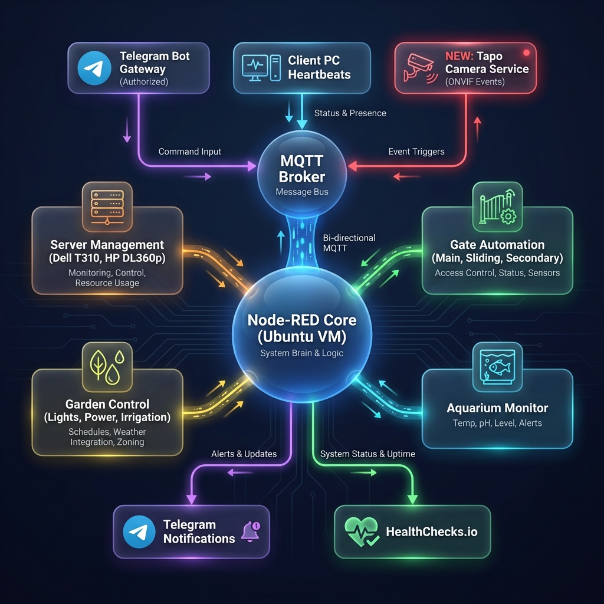

# Comprehensive Home & Server Automation Platform

A unified automation ecosystem for managing servers (Dell T310, HP DL360p), courtyard devices, and house-wide automation through Node-RED, MQTT, and intelligent workflows.

## Features

### Server Management
- 🚀 **Remote Boot** - Wake-on-LAN (Dell T310) and iLO (HP DL360p) based boot
- 🛑 **Remote Shutdown** - Graceful VM shutdown and force shutdown options
- 📊 **Status Monitoring** - Real-time server status via Proxmox API with **Ping Fallback** (Dell T310) and iLO (HP DL360p)
- 🏥 **Health Monitoring** - HealthChecks.io integration with API v3 support
- 🤖 **Smart Automation** - Client-aware boot, 5-minute grace periods, **10-minute shutdown guard**, command cooldown protection
- 📋 **Activity Logging** - Complete audit trail with triggers, commands, and status changes
- 🔄 **Auto-Retry** - Automatic retry logic for transient connection failures

### Client Management (NEW v2.4.0)
- 💻 **Client PC Monitoring** - Automatic server power management based on client PC presence
- 🛑 **Remote Client Shutdown** - Graceful and force shutdown of Windows client PCs
- 💾 **Application Save** - Automatically saves open applications before shutdown
- 🔄 **Auto-Update** - Clients self-update from GitHub releases automatically
- 🎨 **System Tray** - Modern icon with status indicators and update checks

### User Interface & Management
- 🖥️ **Premium Dashboard** - Modern glassmorphism-style Node-RED interface with live countdowns
- 🎛️ **Unified Control Panel** - Manage servers, gates, lights, and sensors from a single interface
- 📊 **Workflow Optimization** - Processes and measures inputs (sensors, heartbeats) to execute complex automation workflows
- 🛠️ **Management Scripts** - Easy-to-use CLI tools for system management
  - `status.sh` - Check service status with color-coded output
  - `manage.sh` - Start/stop/restart services with one command
  - `update.sh` - Safe updates with automatic config preservation
  - `check_env.sh` - Validate environment configuration
- 🔒 **Secure** - TLS/SSL support, credential management, secure .env files
- 📝 **Comprehensive Logging** - Detailed logs for troubleshooting
- 🔄 **Auto-Restart** - Systemd services with automatic restart

## System Architecture



The system serves as a **centralized automation hub** running Node-RED (native installation), Mosquitto MQTT broker, and Python management scripts. It coordinates interactions between servers, courtyard hardware, and residential automation devices.

### Multi-Domain Automation System

The platform supports **multiple automation domains** through a scalable, modular architecture:

**Available Domains:**
- 🖥️ **Server Management** (100-199) - Boot/shutdown control for Dell T310, HP DL360p, client PCs
- 🚪 **Gate Automation** (200-299) - Perimeter gates, garage doors, access control
- 💡 **Lighting Control** (300-399) - Indoor/outdoor lights, scenes, scheduling
- 💧 **Irrigation System** (400-499) - Multi-zone watering with weather integration
- 📱 **SMS/Notifications** (500-599) - Alerts, notifications, messaging
- 📹 **Security/Cameras** (600-699) - Camera feeds, motion detection, recordings
- 🌡️ **HVAC/Climate** (700-799) - Heating, cooling, ventilation control
- ⚡ **Energy Management** (800-899) - Power monitoring, solar, batteries

**Key Features:**
- **Modular Design** - Each domain is independent and self-contained
- **Consistent Structure** - All domains follow the same organizational pattern
- **Easy Integration** - Add new automation types without restructuring
- **Scalable** - Supports unlimited devices and automation rules
- **Template-Based** - Quick setup using pre-built templates

**Documentation:**
- [Automation Architecture](docs/AUTOMATION_ARCHITECTURE.md) - Complete system design
- [Integration Guide](docs/AUTOMATION_INTEGRATION_GUIDE.md) - Step-by-step migration
- [Flow Templates](nodered/templates/README.md) - Ready-to-use templates

### Architecture Highlights:
- **Client Monitoring**: Windows PCs send presence/heartbeat → Automation detects client needs
- **Smart Boot**: Server automatically boots when clients connect (if server is down)
- **Smart Shutdown**: 5-minute grace period when all clients disconnect  
- **Command Cooldown**: 5-minute protection prevents boot/shutdown spam
- **Activity Logging**: Complete audit trail of all automation events

### Server Control Methods:
- **Dell T310**: 
  - **Boot**: Wake-on-LAN (magic packet)
  - **Status**: Proxmox API with 15s timeout and **Ping Fallback** (reports offline if host unreachable)
  - **Shutdown**: Proxmox API for graceful VM shutdown with 10-min watchdog guard
- **HP DL360p**: 
  - **Boot**: iLO power-on command
  - **Status**: iLO with automatic retry
  - **Shutdown**: Proxmox API for graceful VM shutdown

Status and health monitoring is published back through MQTT to the dashboard for real-time visibility.

**Detailed Documentation**: See [docs/ARCHITECTURE.md](docs/ARCHITECTURE.md) for complete system architecture, communication flows, and deployment information.  
**Architecture Diagram Source**: See [docs/ARCHITECTURE_DIAGRAM_DESCRIPTION.md](docs/ARCHITECTURE_DIAGRAM_DESCRIPTION.md) for diagram specification.

## Quick Start

### Prerequisites

- Dell T310 server with Proxmox VE (IPMI optional)
- HP DL360p server with iLO enabled (optional)
- Ubuntu VM for running management scripts
- MQTT broker (Mosquitto recommended)
- Network connectivity between all components

### Installation

1. **Clone the repository:**
   ```bash
   git clone https://github.com/tinel-c/ServerBootShutdownManagemement.git
   cd ServerBootShutdownManagemement
   ```

2. **Run the installation script:**
   ```bash
   chmod +x install.sh
   sudo ./install.sh
   ```

3. **Configure environment variables:**
   
   ```bash
   # Generate .env template
   ./generate_env_template.sh
   
   # Copy and edit with your settings
   sudo cp config/.env.example /opt/dell_server_management/config/.env
   sudo nano /opt/dell_server_management/config/.env
   
   # Set secure permissions
   sudo chmod 600 /opt/dell_server_management/config/.env
   
   # Validate configuration
   ./check_env.sh
   ```
   
   **Required variables:**
   - `MQTT_BROKER_HOST`, `MQTT_BROKER_PORT`, `MQTT_USERNAME`, `MQTT_PASSWORD`
   - `T310_PROXMOX_HOST`, `T310_PROXMOX_USERNAME`, `T310_PROXMOX_PASSWORD`
   - `T310_MAC_ADDRESS` (for Wake-on-LAN)
   
   See [ENV_SETUP_GUIDE.md](ENV_SETUP_GUIDE.md) for detailed configuration instructions.

4. **Enable and start services:**
   ```bash
   # Use the management script for convenience
   chmod +x manage.sh status.sh update.sh check_env.sh
   sudo ./manage.sh enable
   sudo ./manage.sh start
   
   # Check status
   ./status.sh -l
   ```

### Management Scripts

The system includes convenient management scripts for daily operations:

#### Check Service Status
```bash
./status.sh              # Basic status
./status.sh -l           # Status with recent logs
./status.sh -l -n 50     # Status with 50 log lines
./status.sh -a           # Show everything
```

#### Manage Services
```bash
sudo ./manage.sh start    # Start all services
sudo ./manage.sh stop     # Stop all services
sudo ./manage.sh restart  # Restart all services
sudo ./manage.sh enable   # Enable auto-start on boot
sudo ./manage.sh status   # Check status
sudo ./manage.sh logs     # View live logs
```

#### Update System
```bash
git pull
sudo ./update.sh          # Safe update with config preservation
```

#### Validate Configuration
```bash
./check_env.sh            # Check environment variables
```

See [QUICK_REFERENCE.md](QUICK_REFERENCE.md) for complete command reference.

5. **Verify services are running:**
   ```bash
   sudo systemctl status mqtt-boot-listener.service
   sudo systemctl status mqtt-shutdown-listener.service
   sudo systemctl status status-publisher.service
   ```

## Usage

### Client Setup (Windows PCs)

Install the client monitor on Windows PCs for automatic server management:

1. **Download client folder** to Windows PC
2. **Run installer as Administrator:**
   ```cmd
   install_client.bat
   ```
3. **Configure MQTT connection** when prompted
4. **Restart PC** or start manually

The client will:
- ✅ Send presence/heartbeat to automation server
- ✅ Trigger automatic server boot when needed
- ✅ Allow server shutdown when all clients offline
- ✅ Receive remote shutdown commands
- ✅ Auto-update from GitHub releases

**Documentation**: See `client/README_CLIENT.md` for detailed setup

### Remote Client Shutdown (v2.4.0)

Shutdown client PCs from the Node-RED dashboard:

1. Open dashboard: `http://localhost:1880/dashboard`
2. Navigate to "Client Shutdown Control"
3. Select **Graceful** (saves applications) or **Force** (immediate)
4. Confirm operation

**Via MQTT:**
```bash
mosquitto_pub -h <mqtt-broker> -t "clients/CLIENT_ID/command/shutdown" -m '{
  "action": "shutdown",
  "type": "graceful",
  "timestamp": "2026-01-09T15:30:00Z",
  "request_id": "shutdown-001"
}'
```

**Documentation**: See `client/README_CLIENT_SHUTDOWN.md`

### Boot Server via MQTT

Send a boot command to the MQTT topic:

```bash
mosquitto_pub -h <mqtt-broker> -t "dell/t310/command/boot" -m '{
  "action": "boot",
  "method": "wol",
  "timestamp": "2025-12-25T20:00:00+02:00",
  "request_id": "boot-001"
}'
```

Methods:
- `wol` - Wake-on-LAN (recommended for powered-off server)
- `ipmi` - IPMI power on (Dell T310)
- `ilo` - iLO power on (HP DL360p)

**Boot HP DL360p via iLO:**

```bash
mosquitto_pub -h <mqtt-broker> -t "hp/dl360p/command/boot" -m '{
  "action": "boot",
  "method": "ilo",
  "timestamp": "2025-12-26T00:00:00+02:00",
  "request_id": "boot-002"
}'
```

### Shutdown Server via MQTT

Send a shutdown command to the MQTT topic:

```bash
mosquitto_pub -h <mqtt-broker> -t "dell/t310/command/shutdown" -m '{
  "action": "shutdown",
  "type": "graceful",
  "timeout": 300,
  "timestamp": "2025-12-25T20:00:00+02:00",
  "request_id": "shutdown-001"
}'
```

Types:
- `graceful` - Shutdown VMs first, then host (recommended)
- `force` - Immediate hard power off

**Shutdown HP DL360p:**

```bash
mosquitto_pub -h <mqtt-broker> -t "hp/dl360p/command/shutdown" -m '{
  "action": "shutdown",
  "type": "graceful",
  "timeout": 300,
  "timestamp": "2025-12-26T00:00:00+02:00",
  "request_id": "shutdown-002"
}'
```

### Monitor Server Status

Subscribe to the status topic for each server:

```bash
# Monitor Dell T310
mosquitto_sub -h <mqtt-broker> -t "dell/t310/status" -v

# Monitor HP DL360p
mosquitto_sub -h <mqtt-broker> -t "hp/dl360p/status" -v
```

Status messages are published every 30 seconds (configurable).


## 💻 Client PC Monitoring & Automation

Monitor client PCs and automatically manage server power based on client presence.

### Features

- **Automatic Server Boot** - Servers power on when first client PC starts
- **Automatic Server Shutdown** - Servers shut down when all clients are offline (with grace period)
- **Heartbeat Monitoring** - Track active clients in real-time
- **System Tray Icon** - Color-coded status indicator showing connection and server state
- **Windows Integration** - Runs on startup via Task Scheduler
- **Configurable Grace Period** - Prevent rapid power cycling (default: 5 minutes)

### Client Installation

1. **On each Windows PC**, navigate to the `client` directory

2. **Run the installer as Administrator:**
   ```cmd
   Right-click install_client.bat → Run as administrator
   ```

3. **Configure MQTT connection** when prompted:
   - MQTT Broker Host (e.g., `192.168.1.100`)
   - MQTT Broker Port (default: `1883`)
   - MQTT Username
   - MQTT Password

4. **Restart the PC** or start manually:
   ```cmd
   python "C:\Program Files\ClientMonitor\client_monitor.py"
   ```

**To Uninstall:**
```cmd
Right-click client\uninstall_client.bat → Run as administrator
```

### How It Works

```
Client PC Startup → Presence Signal → Server Boots (if offline)
       ↓
   Heartbeat every 60s → Server stays online
       ↓
Client PC Shutdown → Offline Signal → Wait 5 min → Server Shuts Down (if all clients offline)
```

### Monitoring Clients

View active clients in the Node-RED dashboard:
- Navigate to http://localhost:1880/dashboard/home
- Check the "Client PCs" panel
- See active clients with last seen time
- Enable/disable automation with toggle switch

### Client MQTT Topics

```bash
# Monitor client presence
mosquitto_sub -h <mqtt-broker> -t "clients/+/presence" -v

# Monitor client heartbeats
mosquitto_sub -h <mqtt-broker> -t "clients/+/heartbeat" -v
```

**See [client/README_CLIENT.md](client/README_CLIENT.md) for detailed client documentation.**


## 🖥️ Node-RED Dashboard (Modular Architecture)

Modern, feature-rich dashboard with modular flows for easy maintenance and scalability.

### Key Features
- **8 Independent Modules** - Update features without affecting others
- **Real-time Health Monitoring** - Live status cards with countdown timers
- **Client Automation** - Smart boot/shutdown based on client presence
- **Modern UI** - Glassmorphism design with color-coded indicators
- **Telegram Bot** - Optional remote control via Telegram (v2.5.0+)

### Quick Setup

1. **Ensure Node-RED is installed and running on Ubuntu:**
   ```bash
   sudo systemctl status nodered
   ```

2. **If not running, start Node-RED:**
   ```bash
   sudo systemctl start nodered
   ```

3. **Access Node-RED Editor:** http://localhost:1880

4. **Import Modular Flows** (in order):
   ```
   flows/00-base-config.json      # Core configuration (import first)
   flows/10-dell-controls.json    # Dell T310 buttons
   flows/11-dell-status.json      # Dell T310 status display
   flows/12-dell-health.json      # Dell T310 health monitoring
   flows/20-hp-controls.json      # HP DL360p buttons
   flows/21-hp-status.json        # HP DL360p status display
   flows/22-hp-health.json        # HP DL360p health monitoring
   flows/40-client-tracking.json  # Client PC presence tracking
   flows/41-client-automation.json # Server automation based on clients
   flows/50-telegram-interface.json # Telegram bot interface (optional)
   flows/90-log-console.json      # System log console
   ```

5. **Click Deploy** and access dashboard: http://localhost:1880/dashboard/home

### Dashboard Features

#### Per-Server Control Panels
Each server (Dell T310 & HP DL360p) has dedicated panels:
- **Control Buttons**:
  - 🟢 BOOT SERVER - Wake server using appropriate method (WOL/IPMI/iLO)
  - 🟠 PROXMOX SHUTDOWN - Graceful VM + host shutdown
  - 🔴 FORCE SHUTDOWN - Immediate hard power off
  
- **Status Display**:
  - Real-time server state (ONLINE/OFFLINE/UNKNOWN)
  - Last report timestamp with auto-updating countdown
  - State change tracking (when server switched states)
  - Previous state history
  
- **Health Monitoring**:
  - Individual check cards with status icons (✅/❌/⚠️)
  - Statistics: Total pings, grace period, timeout
  - Timing: Last ping, next ping, countdown to next ping
  - Optional data: Methods, subjects, tags, descriptions
  - Clickable badge URLs
  - Color-coded borders (green=up, red=down, orange=warning)

#### System Log Console
- Terminal-style display with dark background
- Color-coded by log level (INFO/WARNING/ERROR/CRITICAL)
- Rolling buffer (last 50 entries)
- Auto-scroll to latest entries
- Subscribes to all MQTT response topics

#### Telegram Bot Interface (Optional)
- 🤖 Control servers via Telegram commands
- 📊 Real-time status notifications
- 🔔 Automatic alerts on server state changes
- 🔐 User authorization support
- **Commands**: `/boot`, `/shutdown`, `/force`, `/status`, `/help`
- **See**: [nodered/TELEGRAM_SETUP.md](nodered/TELEGRAM_SETUP.md) for setup instructions

**Flow Structure:**
```
nodered/flows/
├── 00-base-config.json        # Core configuration
├── 10-12-dell-*.json          # Dell T310 management
├── 20-22-hp-*.json            # HP DL360p management
├── 40-42-client-*.json        # Client tracking & automation
├── 50-telegram-interface.json # Telegram bot (optional)
└── 90-log-console.json        # System logging
```

See `nodered/flows/README.md` for import instructions and `nodered/NODE_RED_DEVELOPMENT.md` for detailed documentation.

### Health Check Integration

The dashboard integrates with **Healthchecks.io** (or compatible services):

**MQTT Payload Example:**
```json
{
  "timestamp": "2025-12-29T10:51:43Z",
  "server": "Dell T310",
  "checks": [
    {
      "name": "nextcloud",
      "status": "up",
      "n_pings": 255949,
      "grace": 300,
      "timeout": 120,
      "last_ping": "2025-12-29T10:50:01+00:00",
      "next_ping": "2025-12-29T10:52:01+00:00",
      "badge_url": "https://healthchecks.io/badge/..."
    }
  ]
}
```

### Configuration Notes

- **MQTT Broker**: Configured in `00-base-config.json`, defaults to `localhost:1883`
- **Dashboard Path**: `/dashboard/home` (customizable in base config)
- **Auto-Refresh**: Status and health widgets update automatically
- **Persistence**: Flow context stores metadata (resets on Node-RED restart)

### Documentation

- **Development Guide**: `nodered/NODE_RED_DEVELOPMENT.md` (800+ lines)
  - Complete feature reference
  - Customization instructions
  - Best practices and conventions
  - Troubleshooting guide
  
- **Quick Reference**: `nodered/flows/README.md`
  - Import instructions
  - File descriptions
  - MQTT payload examples
  
- **Visual Guide**: `nodered/HEALTH_DASHBOARD_GUIDE.md`
  - Dashboard layout explanation
  - Color coding reference
  - Customization options

### Migration from v1.x

If you're using the old monolithic `flows.json`:

1. **Backup existing flows** (Menu → Export → All Flows)
2. **Clear all flows** in Node-RED
3. **Import modular flows** in the order listed above
4. **Deploy and test** all functionality
5. **Archive old flows.json** (automatically renamed to `flows.json.legacy`)

The modular architecture offers better maintainability and makes future updates much easier!

---

*Note: The setup assumes the MQTT broker is running on the host machine (`localhost:1883`). Update the broker configuration in `00-base-config.json` if needed.*

## Configuration

### Environment Variables (.env)

```bash
# MQTT Credentials
MQTT_PASSWORD=your_mqtt_password

# IPMI Credentials
IPMI_HOST=192.168.1.100
IPMI_USERNAME=admin
IPMI_PASSWORD=your_ipmi_password

# Proxmox Credentials
PROXMOX_HOST=192.168.1.100
PROXMOX_USERNAME=root@pam
PROXMOX_PASSWORD=your_proxmox_password

# Server Configuration
SERVER_MAC_ADDRESS=00:11:22:33:44:55

# Logging
LOG_LEVEL=INFO
LOG_FILE=/var/log/dell_t310_management.log
```

### MQTT Topics

| Topic | Direction | Purpose |
|-------|-----------|---------|
| `dell/t310/command/boot` | Client → Server | Boot commands |
| `dell/t310/command/shutdown` | Client → Server | Shutdown commands |
| `dell/t310/status` | Server → Client | Status updates |
| `dell/t310/response` | Server → Client | Command responses |

## Manual Testing

### Test IPMI Connection

```bash
ipmitool -I lanplus -H 192.168.1.100 -U admin -P password chassis status
```

### Test Wake-on-LAN

```bash
wakeonlan 00:11:22:33:44:55
```

### Test Individual Scripts

```bash
# Boot via WoL
python3 /opt/dell_server_management/scripts/boot/wol_boot.py --mac 00:11:22:33:44:55

# Boot via IPMI
python3 /opt/dell_server_management/scripts/boot/ipmi_boot.py

# Graceful shutdown
python3 /opt/dell_server_management/scripts/shutdown/graceful_shutdown.py

# Force shutdown (requires --confirm)
python3 /opt/dell_server_management/scripts/shutdown/force_shutdown.py --confirm
```

## Troubleshooting

### Check Service Logs

```bash
# Boot listener logs
journalctl -u mqtt-boot-listener.service -f

# Shutdown listener logs
journalctl -u mqtt-shutdown-listener.service -f

# Status publisher logs
journalctl -u status-publisher.service -f
```

### Common Issues

1. **MQTT Connection Failed**
   - Verify MQTT broker is running
   - Check network connectivity
   - Verify credentials in `.env`

2. **IPMI Commands Failing**
   - Verify IPMI is enabled in BIOS
   - Check IPMI IP address is correct
   - Test with `ipmitool` command directly

3. **Wake-on-LAN Not Working**
   - Enable WoL in BIOS
   - Verify MAC address is correct
   - Ensure server is on same subnet

## Project Structure

```
ServerBootShutdownMangement/
├── config/                    # Configuration files
│   ├── mqtt_config.yaml
│   └── server_config.yaml
├── scripts/
│   ├── boot/                  # Boot scripts (WOL, IPMI, iLO)
│   ├── shutdown/              # Shutdown scripts (graceful, force)
│   ├── status/                # Status monitoring & health checks
│   └── utils/                 # Utility modules (MQTT, logging)
├── systemd/                   # Systemd service files
├── client/                    # Client PC monitoring application
│   ├── client_monitor.py      # Main client application
│   ├── install_client.bat     # Windows installation script
│   ├── uninstall_client.bat   # Windows uninstallation script
│   ├── requirements_client.txt
│   ├── config/
│   │   ├── client_config.yaml
│   │   └── .env.example
│   └── README_CLIENT.md       # Client documentation
├── nodered/                   # Node-RED dashboard (v2.1 modular)
│   ├── flows/                 # Modular flow files
│   │   ├── 00-base-config.json
│   │   ├── 10-dell-controls.json
│   │   ├── 11-dell-status.json
│   │   ├── 12-dell-health.json
│   │   ├── 20-hp-controls.json
│   │   ├── 21-hp-status.json
│   │   ├── 22-hp-health.json
│   │   ├── 40-client-tracking.json    # NEW: Client presence tracking
│   │   ├── 41-client-automation.json  # NEW: Server automation
│   │   ├── 50-telegram-interface.json # NEW: Telegram bot interface
│   │   ├── 90-log-console.json
│   │   └── README.md
│   ├── NODE_RED_DEVELOPMENT.md
│   ├── HEALTH_DASHBOARD_GUIDE.md
│   ├── TELEGRAM_SETUP.md      # Telegram bot setup guide
│   └── flows.json             # Legacy (deprecated)
├── docs/                      # Documentation
│   ├── archive/               # Historical notes and summaries
│   ├── developer/             # Agent and developer-specific guides
│   ├── SETUP.md
│   ├── MQTT_PROTOCOL.md
│   ├── ARCHITECTURE.md
│   ├── TELEGRAM_INTERFACE.md
│   ├── CLIENT_MANAGEMENT.md
│   ├── DEVELOPMENT.md
│   ├── REFERENCE.md
│   ├── UPDATE.md
│   └── TROUBLESHOOTING.md
├── requirements.txt           # Python dependencies
├── install.sh                 # Installation script
├── uninstall.sh               # Uninstallation script
└── status.sh, manage.sh, ...  # Management scripts
```

## Documentation

### Documentation
- [README.md](README.md) - This file (overview and quick start)
- [Setup Guide](docs/SETUP.md) - Installation and configuration
- [Client Management](docs/CLIENT_MANAGEMENT.md) - Complete client management

### Core Documentation
- [Development Guide](docs/DEVELOPMENT.md) - Development and contribution
- [Architecture](docs/ARCHITECTURE.md) - System architecture and design
- [MQTT Protocol](docs/MQTT_PROTOCOL.md) - Message specifications
- [Telegram Interface](docs/TELEGRAM_INTERFACE.md) - Bot command reference & gateway
- [Troubleshooting](docs/TROUBLESHOOTING.md) - Common issues

### Multi-Domain Automation System (NEW v3.0)
- [Automation Architecture](docs/AUTOMATION_ARCHITECTURE.md) - Complete system design
- [Integration Guide](docs/AUTOMATION_INTEGRATION_GUIDE.md) - Migration walkthrough
- [Flow Templates](nodered/templates/README.md) - Ready-to-use templates
- [MQTT Topic Structure](docs/AUTOMATION_ARCHITECTURE.md#mqtt-topic-structure) - Topic hierarchy

### Node-RED Dashboard
- [Node-RED Development](nodered/NODE_RED_DEVELOPMENT.md) - Complete reference
- [Flows Quick Reference](nodered/flows/README.md) - Import instructions
- [Health Dashboard Guide](nodered/HEALTH_DASHBOARD_GUIDE.md) - Health monitoring
- [Smart Wakeup Guide](nodered/SMART_WAKEUP_GUIDE.md) - Automation guide

### Developer & Agent Guides
- [Workflow](docs/developer/WORKFLOW.md) - Standard development loop
- [Commit Conventions](docs/developer/COMMIT_MESSAGE_CONVENTIONS.md) - Git message standards
- [Commit Checklist](docs/developer/COMMIT_CHECKLIST.md) - Pre-flight checks
- [Documentation Policy](docs/developer/DOCUMENTATION_POLICY.md) - Standards for docs

### Release Information
- [Changelog](CHANGELOG.md) - Complete version history
- [Release Archive](docs/archive/releases/) - Historical release notes (v2.3.0+)
- [Release History](RELEASE_HISTORY.md) - Legacy versions (v1.x - v2.2.0)

## Requirements

### Hardware
- Dell T310 server with IPMI interface
- Network interface with Wake-on-LAN support

### Software
- Ubuntu 22.04+ (on VM)
- Proxmox VE 7.x+
- Python 3.8+
- ipmitool
- MQTT broker (Mosquitto)

## Security Considerations

⚠️ **Important Security Notes:**

- Never commit `.env` file with real credentials
- Use TLS/SSL for MQTT in production
- Restrict IPMI access to management network
- Use strong passwords for all services
- Regularly update all components

## License

[Specify your license here]

## Support

For issues and questions, please refer to:
- [Development Guide](DEVELOPMENT_GUIDE.md)
- [Troubleshooting Guide](docs/TROUBLESHOOTING.md)
- [GitHub Issues](https://github.com/tinel-c/ServerBootShutdownManagemement/issues)

## Repository

**GitHub:** https://github.com/tinel-c/ServerBootShutdownManagemement

## License

This project is licensed under the MIT License - see the [LICENSE](LICENSE) file for details.

## Author

**Constantin Bogza**

---

**Version:** 3.2.0 (Stability & Reliability Release)  
**Last Updated:** 2026-01-18

## Recent Releases

### v3.2.0 (2026-01-18) - Enhanced Stability & Reliability
- 🏥 **Robust Monitoring**: Added Ping Fallback for status reporting (Dell T310)
- 🛡️ **Smart Guard**: 10-minute Shutdown Guard prevents unintended reboot loops
- 👥 **Client-Aware**: Recovery boots now only trigger if clients need server
- ⚡ **Update Performance**: Parallel service stop/start in `update.sh`
- 🛑 **Graceful Exit**: Proper signal handling (SIGTERM) in Python services
- See `RELEASE_NOTES_v3.2.0.md` for details

### v3.0.0 (2026-01-17) - Multi-Domain Automation System
- 🚀 Modular architecture for Gate, Lights, HVAC, etc.
- 📋 Standardized MQTT topic structure
- See `CHANGELOG.md` for details

**Older Versions:** See `RELEASE_HISTORY.md` for v1.x - v2.2.0
