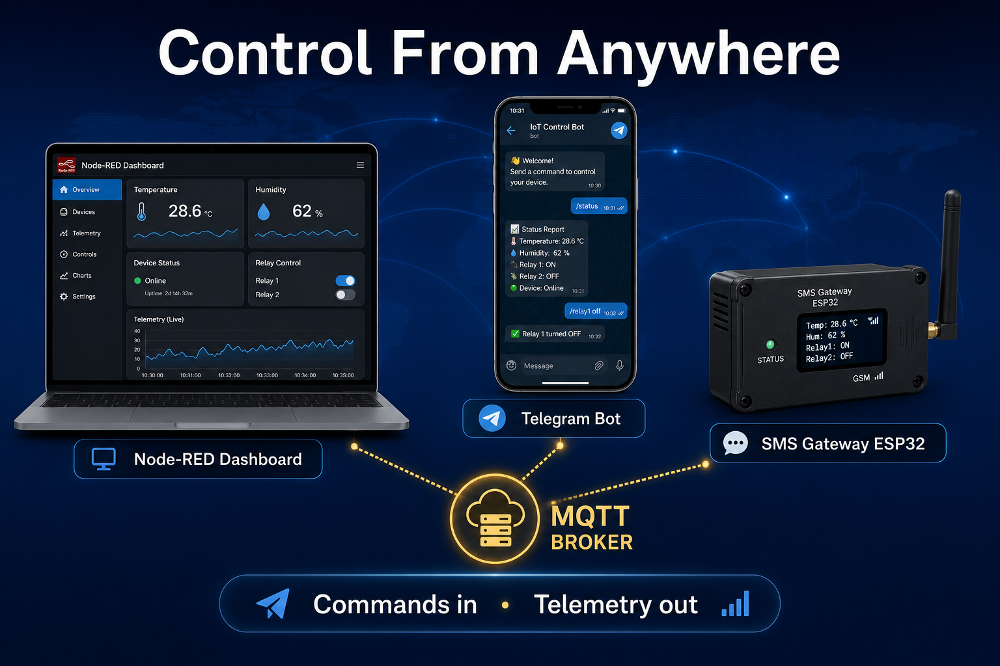
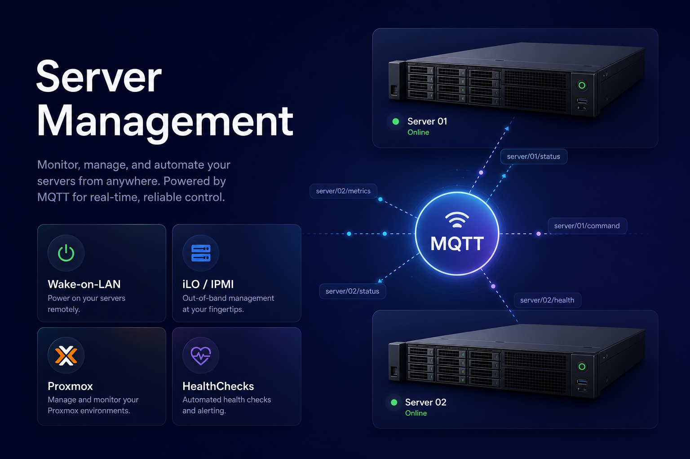
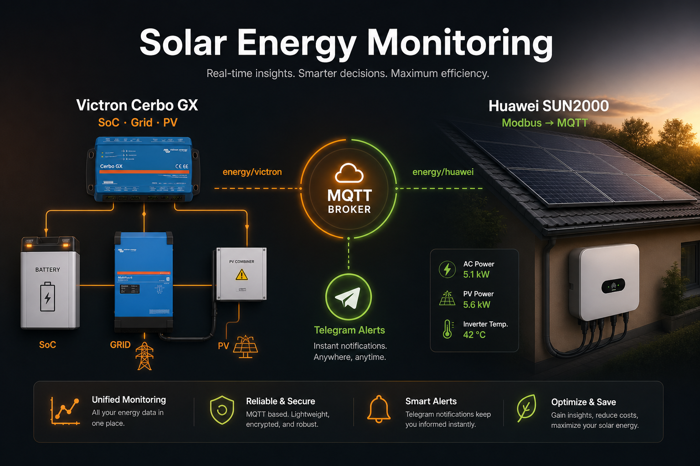
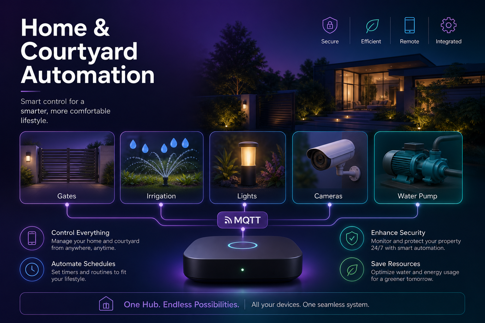
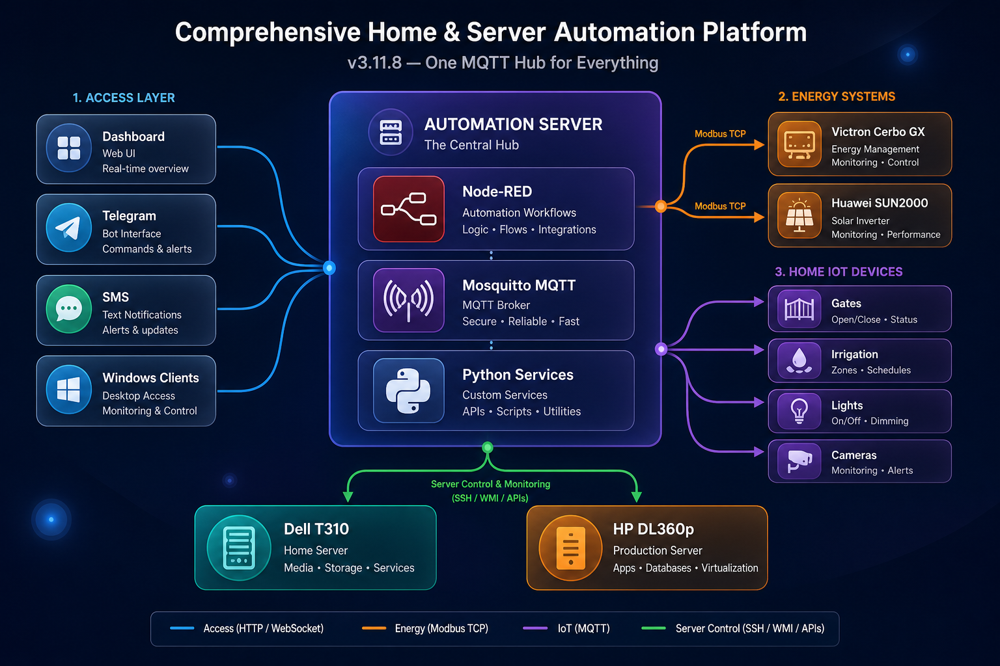

# Comprehensive Home & Server Automation Platform

**One MQTT hub for your homelab and your home.**

This project started as a way to remotely boot and shut down two Proxmox servers (Dell T310 and HP DL360p) without walking to the basement. It grew into a full **home and server automation platform**: the same Ubuntu automation server that powers your servers also runs the courtyard gates, garden irrigation, lights, SMS alerts, Telegram commands, and live solar energy monitoring.

Everything talks over **MQTT**. Node-RED provides dashboards and logic. Python systemd services handle hardware control, Modbus polling, and health checks. You operate it from a browser, Telegram, or SMS — and the system can act on its own when clients connect, solar surplus appears, or a device stops reporting.

<p align="center">
  
  
</p>
<p align="center">
  
  
</p>

## What It Does

Quick map of the five pillars — each has its own Node-RED flow range, MQTT topics, and optional Telegram commands.

### 🖥️ Servers & smart power


| Capability | Details |
|------------|---------|
| **Remote power** | Wake-on-LAN / IPMI (Dell T310), iLO (HP DL360p), graceful Proxmox shutdown |
| **Monitoring** | Live status, HealthChecks.io, ping fallback |
| **Smart automation** | Windows client presence → auto boot; grace-period shutdown when PCs leave |

### ⚡ Energy & solar


| Capability | Details |
|------------|---------|
| **Victron** | Cerbo GX / MultiPlus-II → `energy/victron/*`, headroom automation, 7-day dashboard |
| **Huawei** | SUN2000 grid-tie → `energy/huawei/*`, live PV and daily yield |
| **Forecast** | Open-Meteo solar forecast · Telegram `/energy_*` and `/huawei_*` |

### 🏡 Home & courtyard


| Capability | Details |
|------------|---------|
| **Gates** | Main, sliding, secondary — MQTT + Telegram |
| **Irrigation** | Rain-smart zones, Open-Meteo, dashboard status |
| **Lights & more** | Garden lights, water pump, aquarium, cameras |

### 📱 Control & alerts


| Capability | Details |
|------------|---------|
| **Dashboard** | Node-RED Dashboard 2.0 — glass UI, live countdowns |
| **Telegram** | One bot, domain commands (`/boot`, `/energy_status`, `/huawei_status`, …) |
| **SMS** | ESP32 gateway · watchdog alerts when telemetry stops (2 min) |

Typical setup: an **Ubuntu automation server** on your LAN (e.g. `192.168.2.4`) running Node-RED, Mosquitto, and the Python publishers in this repo. Managed servers and IoT devices connect over Ethernet or WiFi; energy inverters are polled via Modbus.

## How It Works

```
You (Dashboard / Telegram / SMS)  ──►  Node-RED  ──►  Mosquitto MQTT  ──►  Python services
                                              ▲                              │
                                              │                              ▼
                                         Dashboard ◄── MQTT ◄── Servers · Victron · Huawei · ESP32 · Clients
```

1. **Commands** flow in through the dashboard or bots → MQTT → listeners that execute WoL, iLO, Proxmox shutdown, or device actions.
2. **Telemetry** flows back from publishers and devices → MQTT → Node-RED UI, Telegram alerts, and automation rules (e.g. discretionary loads when PV exceeds consumption).
3. **Domains** are modular Node-RED flows (`100` servers, `200` gates, `400` irrigation, `800` energy, …) sharing one broker and one Telegram interface.

See [docs/ARCHITECTURE.md](docs/ARCHITECTURE.md) and the diagram below for the full picture.

## Features

<details open>
<summary><strong>🖥️ Server Management</strong></summary>


- 🚀 **Remote Boot** - Wake-on-LAN (Dell T310) and iLO (HP DL360p) based boot
- 🛑 **Remote Shutdown** - Graceful VM shutdown and force shutdown options
- 📊 **Status Monitoring** - Real-time server status via Proxmox API with **Ping Fallback** (Dell T310) and iLO (HP DL360p)
- 🏥 **Health Monitoring** - HealthChecks.io integration with API v3 support
- 🤖 **Smart Automation** - Client-aware boot, 5-minute grace periods, **10-minute shutdown guard**, command cooldown protection
- 📋 **Activity Logging** - Complete audit trail with triggers, commands, and status changes
- 🔄 **Auto-Retry** - Automatic retry logic for transient connection failures

</details>

<details open>
<summary><strong>⚡ Energy Management (v3.11.6+)</strong></summary>


- ⚡ **Victron Cerbo GX / MultiPlus-II** - Modbus TCP → MQTT (`energy/victron/*`)
- ☀️ **Huawei SUN2000** - Modbus TCP over inverter WiFi AP → MQTT (`energy/huawei/*`) *(v3.11.8+)*
- 🔋 **Live metrics** - Battery SoC, grid import/export, PV, load, inverter state (Victron); PV strings, active power, daily yield (Huawei)
- 🤖 **PV headroom automation** - `headroom_w = PV − consumption`, discretionary load start/stop (Victron)
- ☀️ **Solar forecast** - Open-Meteo for Lunca Cetătui (hourly + daily topics, Victron)
- 📊 **Node-RED dashboard** - Energy page with Victron 7-day chart (flows `800` / `811`) and Huawei live cards (`821`)
- 📱 **Telegram** - Victron `/energy_*` (flow `812`); Huawei `/huawei_status`, `/huawei_help` (flow `822`)
- 🛡️ **Watchdog** - Telegram alert if `energy/victron/status` or `energy/huawei/status` stops (flow `90`, 2 min timeout)

</details>

<details>
<summary><strong>🏡 Home, courtyard & domains</strong></summary>


- 🚪 **Gates** (200–212) — perimeter and garage, MQTT + Telegram
- 💧 **Irrigation** (420–421) — rain-smart scheduling, Open-Meteo, SMS/Telegram alerts
- 💡 **Lights & power** (300–321) — garden Sonoff, Tapo monitor
- 📹 **Cameras** (611) · 🐠 **Aquarium** (500–501) · 💧 **Water pump** (410–411, Tasmota)
- 🔜 **Grundfos SCALA1** (412–413) — *planned* BLE booster; see [docs/GRUNDGOS_SCALA1.md](docs/GRUNDGOS_SCALA1.md)
- 📱 **SMS gateway** (510–514) — ESP32, multi-reply HELP, OTA

</details>

<details>
<summary><strong>💻 Client Management (v2.4.0+)</strong></summary>

- 💻 **Client PC Monitoring** - Automatic server power management based on client PC presence
- 🛑 **Remote Client Shutdown** - Graceful and force shutdown of Windows client PCs
- 💾 **Application Save** - Automatically saves open applications before shutdown
- 🔄 **Auto-Update** - Clients self-update from GitHub releases automatically
- 🎨 **System Tray** - Modern icon with status indicators and update checks

</details>

<details>
<summary><strong>🖥️ User interface & management</strong></summary>


- 🖥️ **Premium Dashboard** - Modern glassmorphism-style Node-RED interface with live countdowns
- 🎛️ **Unified Control Panel** - Manage servers, gates, lights, and sensors from a single interface
- 📊 **Workflow Optimization** - Processes and measures inputs (sensors, heartbeats) to execute complex automation workflows
- 🛠️ **Management Scripts** - Easy-to-use CLI tools for system management
  - `status.sh` - Check service status with color-coded output
  - `manage.sh` - Start/stop/restart services with one command
  - `update.sh` - Safe updates with automatic config preservation
  - `check_env.sh` - Validate environment configuration
- 🔒 **Secure** - TLS/SSL support, credential management, secure .env files
- 📝 **Comprehensive Logging** - Detailed logs for troubleshooting
- 🔄 **Auto-Restart** - Systemd services with automatic restart

</details>

## System Architecture



*Scalable vector source: [docs/architecture_diagram_v4.svg](docs/architecture_diagram_v4.svg)*

The diagram above shows the same hub-and-spoke model: one automation server, many domains, all over MQTT. Energy integrations (Victron + Huawei) sit alongside server management and courtyard/home IoT.

### Multi-Domain Automation System

The platform supports **multiple automation domains** through a scalable, modular architecture:

**Available Domains:**
- 🖥️ **Server Management** (100-199) - Boot/shutdown for Dell T310 & HP DL360p (flows `10`–`22`); client PCs (`40`–`42`)
- 🚪 **Gate Automation** (200-299) - Perimeter gates, garage doors, access control
- 💡 **Lighting Control** (300-399) - Indoor/outdoor lights, scenes, scheduling
- 💧 **Irrigation System** (400-499) - Multi-zone watering with weather integration
- 📱 **SMS/Notifications** (500-599) - Alerts, notifications, messaging
- 📹 **Security/Cameras** (600-699) - Camera feeds, motion detection, recordings
- 🌡️ **HVAC/Climate** (700-799) - Heating, cooling, ventilation control
- ⚡ **Energy Management** (800-899) - Victron Cerbo GX + Huawei SUN2000: Modbus→MQTT, dashboard, Telegram, watchdog — [ENERGY_NODE_RED.md](docs/ENERGY_NODE_RED.md)

**Key Features:**
- **Modular Design** - Each domain is independent and self-contained
- **Consistent Structure** - All domains follow the same organizational pattern
- **Easy Integration** - Add new automation types without restructuring
- **Scalable** - Supports unlimited devices and automation rules
- **Template-Based** - Quick setup using pre-built templates

**Documentation:**
- [Automation Architecture](docs/AUTOMATION_ARCHITECTURE.md) - Complete system design
- [Integration Guide](docs/AUTOMATION_INTEGRATION_GUIDE.md) - Step-by-step migration
- [Flow Templates](nodered/templates/README.md) - Ready-to-use templates

### Architecture Highlights:
- **Client Monitoring**: Windows PCs send presence/heartbeat → Automation detects client needs
- **Smart Boot**: Server automatically boots when clients connect (if server is down)
- **Smart Shutdown**: 5-minute grace period when all clients disconnect  
- **Command Cooldown**: 5-minute protection prevents boot/shutdown spam
- **Activity Logging**: Complete audit trail of all automation events

### Server Control Methods:
- **Dell T310**: 
  - **Boot**: Wake-on-LAN (magic packet)
  - **Status**: Proxmox API with 15s timeout and **Ping Fallback** (reports offline if host unreachable)
  - **Shutdown**: Proxmox API for graceful VM shutdown with 10-min watchdog guard
- **HP DL360p**: 
  - **Boot**: iLO power-on command
  - **Status**: iLO with automatic retry
  - **Shutdown**: Proxmox API for graceful VM shutdown

Status and health monitoring is published back through MQTT to the dashboard for real-time visibility.

**Detailed Documentation**: See [docs/ARCHITECTURE.md](docs/ARCHITECTURE.md) for complete system architecture, communication flows, and deployment information.

**Architecture diagrams** (v3.11.9):
- [architecture_diagram_v4.png](docs/architecture_diagram_v4.png) — README / marketing (GitHub renders PNG)
- [architecture_diagram_v4.svg](docs/architecture_diagram_v4.svg) — scalable source for docs and slides

## Quick Start

### Prerequisites

- Dell T310 server with Proxmox VE (IPMI optional)
- HP DL360p server with iLO enabled (optional)
- Ubuntu VM for running management scripts
- MQTT broker (Mosquitto recommended)
- Network connectivity between all components

### Installation

1. **Clone the repository:**
   ```bash
   git clone https://github.com/tinel-c/ServerBootShutdownManagemement.git
   cd ServerBootShutdownManagemement
   ```

2. **Run the installation script:**
   ```bash
   chmod +x install.sh
   sudo ./install.sh
   ```

3. **Configure environment variables:**
   
   ```bash
   # Generate .env template
   ./generate_env_template.sh
   
   # Copy and edit with your settings
   sudo cp config/.env.example /opt/dell_server_management/config/.env
   sudo nano /opt/dell_server_management/config/.env
   
   # Set secure permissions
   sudo chmod 600 /opt/dell_server_management/config/.env
   
   # Validate configuration
   ./check_env.sh
   ```
   
   **Required variables:**
   - `MQTT_BROKER_HOST`, `MQTT_BROKER_PORT`, `MQTT_USERNAME`, `MQTT_PASSWORD`
   - `T310_PROXMOX_HOST`, `T310_PROXMOX_USERNAME`, `T310_PROXMOX_PASSWORD`
   - `T310_MAC_ADDRESS` (for Wake-on-LAN)
   
   See [docs/ENV_SETUP.md](docs/ENV_SETUP.md) for detailed configuration instructions.

4. **Services:** `install.sh` already enables and starts the five core systemd units and runs the Victron/Huawei device installers (steps 11–12). After editing `.env`, restart as needed:
   ```bash
   chmod +x manage.sh status.sh update.sh check_env.sh
   ./status.sh -l                    # all services including energy publishers
   sudo ./manage.sh restart          # after config changes
   ```
   Energy publishers start only when `device/victron-multiplus-ii/config/.env` and/or `device/huawei-inverter/config/.env` are configured.

### Management Scripts

The system includes convenient management scripts for daily operations:

#### Check Service Status
```bash
./status.sh              # Basic status
./status.sh -l           # Status with recent logs
./status.sh -l -n 50     # Status with 50 log lines
./status.sh -a           # Show everything
```

#### Manage Services
```bash
sudo ./manage.sh start    # Start all services
sudo ./manage.sh stop     # Stop all services
sudo ./manage.sh restart  # Restart all services
sudo ./manage.sh enable   # Enable auto-start on boot
sudo ./manage.sh status   # Check status
sudo ./manage.sh logs     # View live logs
```

#### Update System
```bash
git pull
sudo ./update.sh          # Safe update with config preservation
```

#### Validate Configuration
```bash
./check_env.sh            # Check environment variables
```

See [docs/REFERENCE.md](docs/REFERENCE.md) for complete command reference.

5. **Verify services are running:**
   ```bash
   ./status.sh
   # or individually:
   sudo systemctl status mqtt-boot-listener.service status-publisher.service
   sudo systemctl status victron-mqtt-publisher.service huawei-mqtt-publisher.service
   # Planned (enable after on-site BLE setup): grundfos-scala1-mqtt-publisher.service
   ```

## Usage

### Client Setup (Windows PCs)

Install the client monitor on Windows PCs for automatic server management:

1. **Download client folder** to Windows PC
2. **Run installer as Administrator:**
   ```cmd
   install_client.bat
   ```
3. **Configure MQTT connection** when prompted
4. **Restart PC** or start manually

The client will:
- ✅ Send presence/heartbeat to automation server
- ✅ Trigger automatic server boot when needed
- ✅ Allow server shutdown when all clients offline
- ✅ Receive remote shutdown commands
- ✅ Auto-update from GitHub releases

**Documentation**: See `client/README_CLIENT.md` for detailed setup

### Remote Client Shutdown (v2.4.0)

Shutdown client PCs from the Node-RED dashboard:

1. Open dashboard: `http://localhost:1880/dashboard`
2. Navigate to "Client Shutdown Control"
3. Select **Graceful** (saves applications) or **Force** (immediate)
4. Confirm operation

**Via MQTT:**
```bash
mosquitto_pub -h <mqtt-broker> -t "clients/CLIENT_ID/command/shutdown" -m '{
  "action": "shutdown",
  "type": "graceful",
  "timestamp": "2026-01-09T15:30:00Z",
  "request_id": "shutdown-001"
}'
```

**Documentation**: See `client/README_CLIENT_SHUTDOWN.md`

### Boot Server via MQTT

Send a boot command to the MQTT topic:

```bash
mosquitto_pub -h <mqtt-broker> -t "dell/t310/command/boot" -m '{
  "action": "boot",
  "method": "wol",
  "timestamp": "2025-12-25T20:00:00+02:00",
  "request_id": "boot-001"
}'
```

Methods:
- `wol` - Wake-on-LAN (recommended for powered-off server)
- `ipmi` - IPMI power on (Dell T310)
- `ilo` - iLO power on (HP DL360p)

**Boot HP DL360p via iLO:**

```bash
mosquitto_pub -h <mqtt-broker> -t "hp/dl360p/command/boot" -m '{
  "action": "boot",
  "method": "ilo",
  "timestamp": "2025-12-26T00:00:00+02:00",
  "request_id": "boot-002"
}'
```

### Shutdown Server via MQTT

Send a shutdown command to the MQTT topic:

```bash
mosquitto_pub -h <mqtt-broker> -t "dell/t310/command/shutdown" -m '{
  "action": "shutdown",
  "type": "graceful",
  "timeout": 300,
  "timestamp": "2025-12-25T20:00:00+02:00",
  "request_id": "shutdown-001"
}'
```

Types:
- `graceful` - Shutdown VMs first, then host (recommended)
- `force` - Immediate hard power off

**Shutdown HP DL360p:**

```bash
mosquitto_pub -h <mqtt-broker> -t "hp/dl360p/command/shutdown" -m '{
  "action": "shutdown",
  "type": "graceful",
  "timeout": 300,
  "timestamp": "2025-12-26T00:00:00+02:00",
  "request_id": "shutdown-002"
}'
```

### Monitor Server Status

Subscribe to the status topic for each server:

```bash
# Monitor Dell T310
mosquitto_sub -h <mqtt-broker> -t "dell/t310/status" -v

# Monitor HP DL360p
mosquitto_sub -h <mqtt-broker> -t "hp/dl360p/status" -v
```

Status messages are published every 30 seconds (configurable).


## 💻 Client PC Monitoring & Automation

Monitor client PCs and automatically manage server power based on client presence.

### Features

- **Automatic Server Boot** - Servers power on when first client PC starts
- **Automatic Server Shutdown** - Servers shut down when all clients are offline (with grace period)
- **Heartbeat Monitoring** - Track active clients in real-time
- **System Tray Icon** - Color-coded status indicator showing connection and server state
- **Windows Integration** - Runs on startup via Task Scheduler
- **Configurable Grace Period** - Prevent rapid power cycling (default: 5 minutes)

### Client Installation

1. **On each Windows PC**, navigate to the `client` directory

2. **Run the installer as Administrator:**
   ```cmd
   Right-click install_client.bat → Run as administrator
   ```

3. **Configure MQTT connection** when prompted:
   - MQTT Broker Host (e.g., `192.168.1.100`)
   - MQTT Broker Port (default: `1883`)
   - MQTT Username
   - MQTT Password

4. **Restart the PC** or start manually:
   ```cmd
   python "C:\Program Files\ClientMonitor\client_monitor.py"
   ```

**To Uninstall:**
```cmd
Right-click client\uninstall_client.bat → Run as administrator
```

### How It Works

```
Client PC Startup → Presence Signal → Server Boots (if offline)
       ↓
   Heartbeat every 60s → Server stays online
       ↓
Client PC Shutdown → Offline Signal → Wait 5 min → Server Shuts Down (if all clients offline)
```

### Monitoring Clients

View active clients in the Node-RED dashboard:
- Navigate to http://localhost:1880/dashboard/home
- Check the "Client PCs" panel
- See active clients with last seen time
- Enable/disable automation with toggle switch

### Client MQTT Topics

```bash
# Monitor client presence
mosquitto_sub -h <mqtt-broker> -t "clients/+/presence" -v

# Monitor client heartbeats
mosquitto_sub -h <mqtt-broker> -t "clients/+/heartbeat" -v
```

**See [client/README_CLIENT.md](client/README_CLIENT.md) for detailed client documentation.**


## 🖥️ Node-RED Dashboard (Modular Architecture)

Modern, feature-rich dashboard with modular flows for easy maintenance and scalability.

### Key Features
- **Domain-based modular flows** - Servers, gates, irrigation, energy, SMS, and more as separate JSON files
- **Real-time Health Monitoring** - Live status cards with countdown timers
- **Client Automation** - Smart boot/shutdown based on client presence
- **Modern UI** - Glassmorphism design with color-coded indicators
- **Telegram Bot** - Optional remote control via Telegram (v2.5.0+)

### Quick Setup

1. **Ensure Node-RED is installed and running on Ubuntu:**
   ```bash
   sudo systemctl status nodered
   ```

2. **If not running, start Node-RED:**
   ```bash
   sudo systemctl start nodered
   ```

3. **Access Node-RED Editor:** http://localhost:1880

4. **Import modular flows** from `nodered/flows/` — **full order** in [nodered/flows/README.md](nodered/flows/README.md). Minimum server stack:
   ```
   00-base-config.json → 10–12 (Dell) → 20–22 (HP) → 40–42 (clients) → 50 (Telegram) → 90-log-console.json
   ```
   Add domain flows as needed (`200` gates, `400` irrigation, `500`/`510` SMS, `611` cameras, …). **Energy:** `800` → `811`/`812` (Victron) and/or `821`/`822` (Huawei); re-import `50` and `90-device-watchdog.json` with **Replace existing nodes**. See [docs/ENERGY_NODE_RED.md](docs/ENERGY_NODE_RED.md).

5. **Click Deploy** and access dashboard: http://localhost:1880/dashboard/home  
   Energy page: http://localhost:1880/dashboard/energy

### Dashboard Features

#### Per-Server Control Panels
Each server (Dell T310 & HP DL360p) has dedicated panels:
- **Control Buttons**:
  - 🟢 BOOT SERVER - Wake server using appropriate method (WOL/IPMI/iLO)
  - 🟠 PROXMOX SHUTDOWN - Graceful VM + host shutdown
  - 🔴 FORCE SHUTDOWN - Immediate hard power off
  
- **Status Display**:
  - Real-time server state (ONLINE/OFFLINE/UNKNOWN)
  - Last report timestamp with auto-updating countdown
  - State change tracking (when server switched states)
  - Previous state history
  
- **Health Monitoring**:
  - Individual check cards with status icons (✅/❌/⚠️)
  - Statistics: Total pings, grace period, timeout
  - Timing: Last ping, next ping, countdown to next ping
  - Optional data: Methods, subjects, tags, descriptions
  - Clickable badge URLs
  - Color-coded borders (green=up, red=down, orange=warning)

#### System Log Console
- Terminal-style display with dark background
- Color-coded by log level (INFO/WARNING/ERROR/CRITICAL)
- Rolling buffer (last 50 entries)
- Auto-scroll to latest entries
- Subscribes to all MQTT response topics

#### Telegram Bot Interface (Optional)
- 🤖 Control servers, gates, lights, irrigation, **Victron/Huawei energy**, and more via Telegram
- 📊 Real-time status notifications
- 🔔 Automatic alerts on server state changes and device watchdog events
- 🔐 User authorization support
- **Server commands**: `/boot`, `/shutdown`, `/force`, `/status`, `/help`
- **Energy commands (Victron)**: `/energy_status`, `/energy_start`, `/energy_stop`, `/energy_help`
- **Energy commands (Huawei)**: `/huawei_status`, `/huawei_help`
- **See**: [docs/TELEGRAM_INTERFACE.md](docs/TELEGRAM_INTERFACE.md), [nodered/TELEGRAM_SETUP.md](nodered/TELEGRAM_SETUP.md)

**Flow Structure:**
```
nodered/flows/
├── 00-base-config.json        # Core configuration
├── 10-12-dell-*.json          # Dell T310 management
├── 20-22-hp-*.json            # HP DL360p management
├── 40-42-client-*.json        # Client tracking & automation
├── 50-telegram-interface.json # Telegram bot (optional)
├── 800-812-victron-*.json   # Victron energy dashboard + Telegram
├── 821-822-huawei-*.json    # Huawei solar dashboard + Telegram
├── 90-device-watchdog.json  # MQTT heartbeat watchdog (all devices + energy publishers)
└── 90-log-console.json        # System logging
```

See `nodered/flows/README.md` for import instructions and `nodered/NODE_RED_DEVELOPMENT.md` for detailed documentation.

### Health Check Integration

The dashboard integrates with **Healthchecks.io** (or compatible services):

**MQTT Payload Example:**
```json
{
  "timestamp": "2025-12-29T10:51:43Z",
  "server": "Dell T310",
  "checks": [
    {
      "name": "nextcloud",
      "status": "up",
      "n_pings": 255949,
      "grace": 300,
      "timeout": 120,
      "last_ping": "2025-12-29T10:50:01+00:00",
      "next_ping": "2025-12-29T10:52:01+00:00",
      "badge_url": "https://healthchecks.io/badge/..."
    }
  ]
}
```

### Configuration Notes

- **MQTT Broker**: Configured in `00-base-config.json`, defaults to `localhost:1883`
- **Dashboard Path**: `/dashboard/home` (customizable in base config)
- **Auto-Refresh**: Status and health widgets update automatically
- **Persistence**: Flow context stores metadata (resets on Node-RED restart)

### Documentation

- **Development Guide**: `nodered/NODE_RED_DEVELOPMENT.md` (800+ lines)
  - Complete feature reference
  - Customization instructions
  - Best practices and conventions
  - Troubleshooting guide
  
- **Quick Reference**: `nodered/flows/README.md`
  - Import instructions
  - File descriptions
  - MQTT payload examples
  
- **Visual Guide**: `nodered/HEALTH_DASHBOARD_GUIDE.md`
  - Dashboard layout explanation
  - Color coding reference
  - Customization options

### Migration from v1.x

If you still have the old monolithic `flows.json` on your Node-RED server (not shipped in this repo):

1. **Backup existing flows** (Menu → Export → All Flows)
2. **Clear all flows** in Node-RED
3. **Import modular flows** per [nodered/flows/README.md](nodered/flows/README.md)
4. **Deploy and test** all functionality

---

*Note: The setup assumes the MQTT broker is running on the host machine (`localhost:1883`). Update the broker configuration in `00-base-config.json` if needed.*

## Configuration

### Environment Variables (.env)

Server-wide settings live in `config/.env` (from `config/.env.example`). Per-device Modbus/MQTT settings are in `device/victron-multiplus-ii/config/.env` and `device/huawei-inverter/config/.env`.

```bash
# MQTT (required)
MQTT_BROKER_HOST=192.168.2.4
MQTT_BROKER_PORT=1883
MQTT_USERNAME=dell_server_mgmt
MQTT_PASSWORD=your_mqtt_password_here

# Dell T310
T310_IPMI_HOST=192.168.1.100
T310_PROXMOX_HOST=192.168.1.100
T310_MAC_ADDRESS=00:11:22:33:44:55

# HP DL360p (optional)
DL360P_ILO_HOST=192.168.1.101
DL360P_PROXMOX_HOST=192.168.1.101

# Logging
LOG_LEVEL=INFO
LOG_FILE=/var/log/dell_server_management.log
```

Run `./generate_env_template.sh` to refresh the template from the repo. See [docs/ENV_SETUP.md](docs/ENV_SETUP.md) for the full variable list.

### MQTT Topics

| Topic | Direction | Purpose |
|-------|-----------|---------|
| `dell/t310/command/boot` | Client → Server | Boot commands |
| `dell/t310/command/shutdown` | Client → Server | Shutdown commands |
| `dell/t310/status` | Server → Client | Status updates |
| `dell/t310/response` | Server → Client | Command responses |
| `energy/victron/#` | Server → Client | Victron Cerbo GX energy metrics (Modbus publisher) |
| `energy/huawei/#` | Server → Client | Huawei SUN2000 solar metrics (Modbus publisher) |

Victron topics are documented in [MQTT Protocol — Victron Energy](docs/MQTT_PROTOCOL.md#victron-energy-topics-domain-energyvictron). Huawei topics in [MQTT Protocol — Huawei Energy](docs/MQTT_PROTOCOL.md#huawei-energy-topics-domain-energyhuawei). Node-RED dashboard: [ENERGY_NODE_RED.md](docs/ENERGY_NODE_RED.md).

## Manual Testing

### Test IPMI Connection

```bash
ipmitool -I lanplus -H 192.168.1.100 -U admin -P password chassis status
```

### Test Wake-on-LAN

```bash
wakeonlan 00:11:22:33:44:55
```

### Test Individual Scripts

```bash
# Boot via WoL
python3 /opt/dell_server_management/scripts/boot/wol_boot.py --mac 00:11:22:33:44:55

# Boot via IPMI
python3 /opt/dell_server_management/scripts/boot/ipmi_boot.py

# Graceful shutdown
python3 /opt/dell_server_management/scripts/shutdown/graceful_shutdown.py

# Force shutdown (requires --confirm)
python3 /opt/dell_server_management/scripts/shutdown/force_shutdown.py --confirm
```

## Troubleshooting

### Check Service Logs

```bash
# Boot listener logs
journalctl -u mqtt-boot-listener.service -f

# Shutdown listener logs
journalctl -u mqtt-shutdown-listener.service -f

# Status publisher logs
journalctl -u status-publisher.service -f
```

### Common Issues

1. **MQTT Connection Failed**
   - Verify MQTT broker is running
   - Check network connectivity
   - Verify credentials in `.env`

2. **IPMI Commands Failing**
   - Verify IPMI is enabled in BIOS
   - Check IPMI IP address is correct
   - Test with `ipmitool` command directly

3. **Wake-on-LAN Not Working**
   - Enable WoL in BIOS
   - Verify MAC address is correct
   - Ensure server is on same subnet

## Project Structure

Installed on the automation server at **`/opt/dell_server_management`** (via `install.sh`). Flow numbering follows [Automation Architecture](docs/AUTOMATION_ARCHITECTURE.md) — each domain uses its own `NNN-*.json` files under `nodered/flows/`.

```
ServerBootShutdownManagemement/
├── install.sh                      # Full install (core + Victron + Huawei services)
├── update.sh                       # Safe in-place upgrade (preserves .env)
├── uninstall.sh
├── install_victron_service.sh      # Energy publisher only (also called from install.sh)
├── install_huawei_service.sh
├── install_grundfos_service.sh
├── manage.sh · status.sh · check_env.sh · generate_env_template.sh
│
├── config/                         # Server-wide secrets & YAML (gitignored: .env)
│   ├── .env.example
│   ├── mqtt_config.yaml
│   └── server_config.yaml
│
├── device/                         # Hardware integrations (Modbus, ESP32, …)
│   ├── victron-multiplus-ii/       # Cerbo GX → energy/victron/*
│   ├── huawei-inverter/            # SUN2000 → energy/huawei/*
│   ├── esp32-sms-gateway/          # Git submodule → SMS/OTA firmware
│   └── README.md
│
├── scripts/
│   ├── boot/ · shutdown/ · status/ # MQTT listeners & publishers (Python)
│   ├── utils/                      # Shared MQTT, logging, IPMI helpers
│   ├── install/                    # common.sh, device_service.sh (shared installers)
│   ├── release/                    # create_release.{sh,ps1,bat}
│   └── server/                     # Remote deploy, sudo grants, Huawei WiFi setup
│
├── systemd/                        # All units copied to /etc/systemd/system/
│   ├── mqtt-boot-listener.service
│   ├── mqtt-shutdown-listener.service
│   ├── status-publisher.service
│   ├── health-monitor.service
│   ├── tapo-monitor.service
│   ├── victron-mqtt-publisher.service
│   ├── victron-solar-forecast-publisher.service
│   ├── huawei-mqtt-publisher.service
│   └── grundfos-scala1-mqtt-publisher.service  # planned — manual install only
│
├── nodered/
│   ├── flows/                      # Import in order — see flows/README.md
│   │   ├── 00-base-config.json     # MQTT broker, dashboard shell
│   │   ├── 10–12, 20–22           # Dell T310 & HP DL360p (100–199)
│   │   ├── 40–42                   # Client tracking & automation (40–49)
│   │   ├── 50-telegram-interface.json
│   │   ├── 200–212                 # Gates (200–299)
│   │   ├── 300–321                 # Garden power & lights (300–399)
│   │   ├── 400–421                 # Irrigation (400–499)
│   │   ├── 500–514                 # Aquarium, SMS gateway (500–599)
│   │   ├── 611                     # Cameras (600–699)
│   │   ├── 800–822                 # Energy: Victron + Huawei (800–899)
│   │   ├── 90-device-watchdog.json # MQTT heartbeat watchdog (all domains)
│   │   ├── 90-log-console.json
│   │   └── README.md
│   ├── live-connection/            # Backup/sync tooling for live Node-RED
│   ├── templates/                  # Flow templates for new domains
│   └── *.md                        # Node-RED development guides
│
├── client/                         # Windows client monitor (presence, shutdown, auto-update)
│
├── docs/
│   ├── images/                     # README topic banners
│   ├── releases/                   # RELEASE_NOTES_v*.md per version
│   ├── archive/                    # Historical notes
│   ├── developer/                  # Deploy, env, device submodules
│   ├── ARCHITECTURE.md · MQTT_PROTOCOL.md · ENERGY_NODE_RED.md
│   ├── SETUP.md · UPDATE.md · REFERENCE.md · TROUBLESHOOTING.md
│   └── architecture_diagram_v4.{svg,png}
│
└── CHANGELOG.md · RELEASE_HISTORY.md · requirements.txt · LICENSE
```

**Quick paths**

| Goal | Start here |
|------|------------|
| First install | [docs/SETUP.md](docs/SETUP.md) → `sudo ./install.sh` |
| Energy (Victron / Huawei) | [docs/ENERGY_NODE_RED.md](docs/ENERGY_NODE_RED.md), `device/*/README.md` |
| Grundfos SCALA1 *(planned)* | [docs/GRUNDGOS_SCALA1.md](docs/GRUNDGOS_SCALA1.md) |
| Node-RED import order | [nodered/flows/README.md](nodered/flows/README.md) |
| MQTT topic reference | [docs/MQTT_PROTOCOL.md](docs/MQTT_PROTOCOL.md) |
| GitHub release | [docs/releases/](docs/releases/) + `scripts/release/create_release.sh` |

## Documentation

- [README.md](README.md) - This file (overview and quick start)
- [Setup Guide](docs/SETUP.md) - Installation and configuration
- [Client Management](docs/CLIENT_MANAGEMENT.md) - Complete client management

### Core Documentation
- [Development Guide](docs/DEVELOPMENT.md) - Development and contribution
- [Architecture](docs/ARCHITECTURE.md) - System architecture and design
- [MQTT Protocol](docs/MQTT_PROTOCOL.md) - Message specifications
- [Energy / Node-RED](docs/ENERGY_NODE_RED.md) - Victron flows 800–812, Huawei flows 821–822
- [Victron device README](device/victron-multiplus-ii/README.md) - Cerbo setup, Modbus, systemd install
- [Huawei device README](device/huawei-inverter/README.md) - SUN2000 WiFi AP, Modbus, systemd install
- [Grundfos SCALA1 *(planned)*](docs/GRUNDGOS_SCALA1.md) - BLE scaffolding; not production-ready
- [Telegram Interface](docs/TELEGRAM_INTERFACE.md) - Bot command reference & gateway
- [SMS Interface](docs/SMS_INTERFACE.md) - SMS command reference & emergency forwarding
- [Troubleshooting](docs/TROUBLESHOOTING.md) - Common issues

### Multi-Domain Automation System (NEW v3.0)
- [Automation Architecture](docs/AUTOMATION_ARCHITECTURE.md) - Complete system design
- [Integration Guide](docs/AUTOMATION_INTEGRATION_GUIDE.md) - Migration walkthrough
- [Flow Templates](nodered/templates/README.md) - Ready-to-use templates
- [MQTT Topic Structure](docs/AUTOMATION_ARCHITECTURE.md#mqtt-topic-structure) - Topic hierarchy

### Node-RED Dashboard
- [Node-RED Development](nodered/NODE_RED_DEVELOPMENT.md) - Complete reference
- [Flows Quick Reference](nodered/flows/README.md) - Import instructions
- [Health Dashboard Guide](nodered/HEALTH_DASHBOARD_GUIDE.md) - Health monitoring
- [Smart Wakeup Guide](nodered/SMART_WAKEUP_GUIDE.md) - Automation guide

### Developer & Agent Guides
- [Workflow](docs/developer/WORKFLOW.md) - Standard development loop
- [Commit Conventions](docs/developer/COMMIT_MESSAGE_CONVENTIONS.md) - Git message standards
- [Commit Checklist](docs/developer/COMMIT_CHECKLIST.md) - Pre-flight checks
- [Documentation Policy](docs/developer/DOCUMENTATION_POLICY.md) - Standards for docs
- [OTA Device Updates](docs/developer/OTA_DEVICE_UPDATES.md) - OTA update development guide

### Release Information
- [Changelog](CHANGELOG.md) - Complete version history
- [Release notes](docs/releases/) - Per-version notes (v2.3.0 through current)
- [Release History](RELEASE_HISTORY.md) - Legacy versions (v1.x - v2.2.0)

## Requirements

### Hardware (pick what you use)
- **Servers:** Dell T310 (WoL/IPMI + Proxmox) and/or HP DL360p (iLO + Proxmox)
- **Automation host:** Ubuntu VM/PC on the LAN (runs this repo’s Python services and Node-RED)
- **Optional:** Victron Cerbo GX, Huawei SUN2000, ESP32 SMS gateway, Tasmota/Sonoff IoT, Tapo cameras

### Software
- Ubuntu 22.04+ on the automation server
- Proxmox VE 7.x+ on managed hosts
- Python 3.8+, Mosquitto MQTT broker, Node-RED (+ Dashboard 2.0)
- `ipmitool` (Dell IPMI), network WoL support where used

## Security Considerations

⚠️ **Important Security Notes:**

- Never commit `.env` file with real credentials
- Use TLS/SSL for MQTT in production
- Restrict IPMI access to management network
- Use strong passwords for all services
- Regularly update all components

## Support

For issues and questions, please refer to:
- [Development Guide](docs/DEVELOPMENT.md)
- [Troubleshooting Guide](docs/TROUBLESHOOTING.md)
- [GitHub Issues](https://github.com/tinel-c/ServerBootShutdownManagemement/issues)

## Repository

**GitHub:** https://github.com/tinel-c/ServerBootShutdownManagemement

## License

This project is licensed under the MIT License - see the [LICENSE](LICENSE) file for details.

## Author

**Constantin Bogza**

---

**Version:** 3.11.9  
**Last Updated:** 2026-07-04

## Recent Releases

### v3.12.0 (2026-07-04) - Planned: Grundfos SCALA1 scaffolding
- 🔜 **Grundfos SCALA1** — BLE probe, MQTT publisher skeleton, flows `412`/`413`, docs (not production until GATT capture on site)
- See [RELEASE_NOTES_v3.12.0.md](docs/releases/RELEASE_NOTES_v3.12.0.md) and [GRUNDGOS_SCALA1.md](docs/GRUNDGOS_SCALA1.md)

### v3.11.9 (2026-07-04) - Install cleanup & architecture diagram
- 🔧 **Unified install** — `install.sh` enables core + Victron + Huawei services; shared `scripts/install/` helpers
- 📁 **Repo cleanup** — release notes in `docs/releases/`; generic `scripts/release/create_release.*`
- 📊 **Architecture v4** — SVG + PNG platform diagram; README hero images and project structure refresh
- See [RELEASE_NOTES_v3.11.9.md](docs/releases/RELEASE_NOTES_v3.11.9.md) and [CHANGELOG.md](CHANGELOG.md)

### v3.11.8 (2026-07-04) - Huawei SUN2000 energy integration
- ☀️ **Huawei SUN2000** Modbus→MQTT publisher over inverter WiFi AP (`energy/huawei/*`)
- 📊 **Node-RED** flows `821` / `822` — live dashboard + Telegram `/huawei_*`
- 🛡️ **Watchdog** monitors `energy/huawei/status` (2 min); `/help` updated in flow `50`
- See [RELEASE_NOTES_v3.11.8.md](docs/releases/RELEASE_NOTES_v3.11.8.md) and [CHANGELOG.md](CHANGELOG.md)

### v3.11.6 (2026-07-04) - Victron energy integration
- ⚡ **Cerbo GX / MultiPlus-II** Modbus→MQTT publisher + Open-Meteo solar forecast
- 📊 **Node-RED** flows `800` / `811` / `812` — dashboard, 7-day chart, discretionary load controls
- 📱 **Telegram** `/energy_*` commands; `/help` updated with Victron section
- 🛡️ **Watchdog** monitors `energy/victron/status` (2 min); state-change-only alerts for all devices
- See [RELEASE_NOTES_v3.11.6.md](docs/releases/RELEASE_NOTES_v3.11.6.md) and [CHANGELOG.md](CHANGELOG.md)

### v3.10.6 (2026-04-11) - Irrigation 421 weekdays, season & schedule
- 📅 **Weekday gates** for automatic Lawn/Flowers; **Mar–Nov** irrigation season; **season-themed** Irrigation days card.
- See `CHANGELOG.md` for details.

### v3.10.0 (2026-02-08) - SMS Multi-Reply & Comprehensive HELP
- 📱 **Multi-SMS replies** - HELP/COMMANDS send 8 SMS with full descriptions (3s + 5s spacing)
- 📋 **LIST** alias - Same as COMMANDS (Telegram parity)
- 📷 **Camera commands** - CAMERA_STATUS, CAMERA_HELP via SMS
- See [RELEASE_NOTES_v3.10.0.md](docs/releases/RELEASE_NOTES_v3.10.0.md) for details

### v3.7.0 (2026-01-25) - SMS Gateway Node-RED Integration
- 🎛️ **Node-RED Dashboard** - Complete management interface for SMS Gateway
- 📱 **SMS Controls** - Send SMS via web UI with phone number and message inputs
- 📋 **Message Logging** - Complete history of received SMS messages (last 100)
- 🤖 **Telegram Integration** - `/sms`, `/sms_status`, `/sms_log` commands
- 🛡️ **Watchdog Monitoring** - SMS Gateway health monitoring with Telegram alerts
- ✅ **Device Online Notification** - Automatic SMS when device initializes
- See [RELEASE_NOTES_v3.7.0.md](docs/releases/RELEASE_NOTES_v3.7.0.md) for details

### v3.6.0 (2026-01-25) - SMS Gateway Device & OTA Updates
- 📱 **SMS Gateway Device** - Embedded ESP32 + SIM800 device for SMS send/receive via MQTT
- 🔄 **OTA Updates** - Over-The-Air firmware updates with MQTT control and progress tracking
- 🛡️ **Self-Recovery** - Automatic WiFi/MQTT reconnection and reset detection
- 📚 **Developer Guide** - Comprehensive OTA development guide
- See [RELEASE_NOTES_v3.6.0.md](docs/releases/RELEASE_NOTES_v3.6.0.md) for details

### v3.2.0 (2026-01-18) - Enhanced Stability & Reliability
- 🏥 **Robust Monitoring**: Added Ping Fallback for status reporting (Dell T310)
- 🛡️ **Smart Guard**: 10-minute Shutdown Guard prevents unintended reboot loops
- 👥 **Client-Aware**: Recovery boots now only trigger if clients need server
- ⚡ **Update Performance**: Parallel service stop/start in `update.sh`
- 🛑 **Graceful Exit**: Proper signal handling (SIGTERM) in Python services
- See [RELEASE_NOTES_v3.2.0.md](docs/releases/RELEASE_NOTES_v3.2.0.md) for details

### v3.0.0 (2026-01-17) - Multi-Domain Automation System
- 🚀 Modular architecture for Gate, Lights, HVAC, etc.
- 📋 Standardized MQTT topic structure
- See `CHANGELOG.md` for details

**Older Versions:** See `RELEASE_HISTORY.md` for v1.x - v2.2.0
