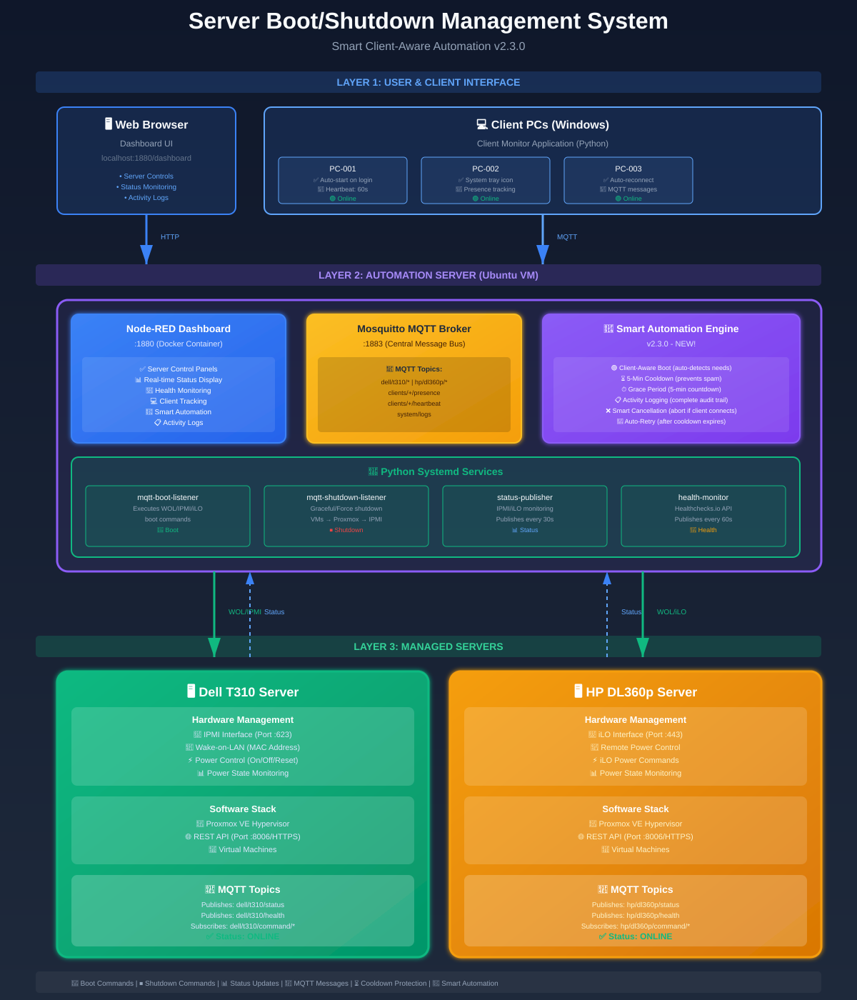

# System Architecture Documentation

## Overview

The Server Boot/Shutdown Management System uses a centralized automation server architecture where all control, monitoring, and management logic resides on a single Ubuntu VM running Node-RED (native installation) and Python services.



## Components

### 0. Client PC Layer (v2.1.0+ with v2.4.0 enhancements)

#### Windows Client PCs
- **Client Monitor Application**: Python application running on Windows PCs
  - **Installation**: Installed via `install_client.bat` in `C:\Program Files\ClientMonitor`
  - **Startup**: Runs automatically on user login via Windows Task Scheduler
  - **Communication**: MQTT-based presence, heartbeat, and command reception
  - **System Tray**: Icon named "ClientServerBootShutdownManagement" with status indicators
  - **Features**:
    - Sends "online" presence message on startup
    - Sends heartbeat every 60 seconds
    - Sends "offline" presence message on shutdown
    - **Remote Shutdown** (NEW v2.4.0): Receives and executes shutdown commands
    - **Application Save** (NEW v2.4.0): Gracefully saves open applications before shutdown
    - **Auto-Update** (NEW v2.4.0): Checks GitHub for updates and installs automatically
    - Automatic reconnection on network interruptions
    - Logging to `logs/client_monitor.log`

- **MQTT Topics Published**:
  - `clients/{client_id}/presence` - Startup/shutdown notifications
  - `clients/{client_id}/heartbeat` - Periodic heartbeat messages
  - `clients/{client_id}/response` - Command execution responses (NEW v2.4.0)

- **MQTT Topics Subscribed**:
  - `clients/{client_id}/command/shutdown` - Remote shutdown commands (NEW v2.4.0)

- **Purpose**: Enable automatic server power management based on client PC usage patterns and centralized client management

### 1. User Interface Layer

#### Web Browser (User Access Point)
- **Access Method**: HTTP connection to Node-RED dashboard
- **URL**: `http://automation-server:1880/dashboard/home`
- **Functionality**: 
  - Control interface for server boot/shutdown operations
  - Real-time status monitoring (online/offline states)
  - Health check visualization with live countdown timers
  - System log console

### 2. Automation Server (Central Hub)

The automation server is an Ubuntu VM that hosts all management components:

#### A. Node-RED Dashboard (Native Installation)
- **Technology**: Node-RED with Dashboard 2.0 (@flowfuse/node-red-dashboard)
- **Port**: 1880 (HTTP)
- **Deployment**: Native installation on Ubuntu (systemd service)
- **Features**:
  - **Control Panels**: Boot and shutdown buttons for each server
    - Dell T310: WoL/IPMI boot, graceful/force shutdown
    - HP DL360p: iLO boot, graceful/force shutdown
  - **Status Display**: Real-time server state with metadata tracking
  - **Health Monitoring**: Comprehensive health check cards with 16+ data points
  - **Client Monitoring**: Track active client PCs in real-time
  - **Client Shutdown Control** (NEW v2.4.0): Remote shutdown of client PCs with graceful/force options
  - **Automation Control**: Enable/disable automatic server power management
  - **Log Console**: Rolling log display (50-entry buffer)
- **Communication**: Publishes commands to MQTT, subscribes to status/health/client topics

#### B. Mosquitto MQTT Broker
- **Technology**: Eclipse Mosquitto
- **Port**: 1883 (TCP)
- **Role**: Central message bus for all system communication
- **Topics Structure**:
  ```
  Commands (Dashboard → Scripts):
  - dell/t310/command/boot
  - dell/t310/command/shutdown
  - hp/dl360p/command/boot
  - hp/dl360p/command/shutdown
  
  Status/Health (Scripts → Dashboard):
  - dell/t310/status (published every 30s)
  - dell/t310/health (published every 60s)
  - hp/dl360p/status (published every 30s)
  - hp/dl360p/health (published every 60s)
  - system/logs (centralized logging)
  
  Client PCs (Bidirectional, v2.1.0+, enhanced v2.4.0):
  - clients/{client_id}/presence (startup/shutdown)
  - clients/{client_id}/heartbeat (every 60s)
  - clients/{client_id}/command/shutdown (shutdown commands, NEW v2.4.0)
  - clients/{client_id}/response (command responses, NEW v2.4.0)
  - automation/clients/status (automation state)
  ```

#### C. Python Management Scripts (Systemd Services)
Running as background services on the automation server:

1. **mqtt_boot_listener.service**
   - Subscribes to: `*/*/command/boot` topics
   - Executes boot operations:
     - Dell T310: Sends Wake-on-LAN magic packet OR IPMI power-on command
     - HP DL360p: Sends iLO power-on command
   - Publishes response messages

2. **mqtt_shutdown_listener.service**
   - Subscribes to: `*/*/command/shutdown` topics
   - Executes shutdown operations:
     - **Graceful**: 
       1. Connect to Proxmox API
       2. Shutdown all running VMs (except HA-managed)
       3. Wait for VMs to stop (configurable timeout)
       4. Shutdown Proxmox host via API (OS-level)
       5. Fallback to IPMI/iLO if API fails
     - **Force**: Direct hardware power-off via IPMI/iLO
   - Publishes response messages

3. **status_publisher.service**
   - Monitors server power state via IPMI/iLO
   - Publishes status every 30 seconds to respective status topics
   - Payload includes: server_state (online/offline/unknown), timestamp

4. **health_monitor.service** (optional)
   - Polls Healthchecks.io API for health check data
   - Publishes health information every 60 seconds
   - Includes all check details (pings, grace period, timeouts, etc.)

### 3. Network Layer

**Local Network**: All components communicate via standard Ethernet/WiFi network

**Protocols Used**:
- **HTTP**: User browser ↔ Node-RED dashboard
- **MQTT**: All internal system communication
- **Wake-on-LAN**: Magic packet broadcast for Dell T310 boot
- **iLO/IPMI**: Management interface protocols
- **Proxmox API**: HTTPS RESTful API for VM/host management

### 4. Managed Servers

#### Dell T310 Server (Green)

**Hardware Management**:
- **IPMI Interface** (Port: typically 623/UDP)
  - Receives Wake-on-LAN magic packets
  - IPMI power control (power on/off/reset)
  - Power state monitoring
  - MAC Address: Configured for WoL reception

**Software Stack**:
- **Proxmox VE Hypervisor**
  - Hosts virtual machines
  - Provides RESTful API (Port 8006/HTTPS)
  - Manages VM lifecycle
  - Enables graceful shutdown sequence

**MQTT Communication**:
- **Publishes**:
  - `dell/t310/status`: Power state updates (online/offline)
  - `dell/t310/health`: Health check data from monitoring
- **Subscribes**: Scripts on automation server listen to command topics

#### HP DL360p Server (Orange)

**Hardware Management**:
- **iLO Interface** (Integrated Lights-Out)
  - Remote power control
  - iLO power-on command reception
  - Power state monitoring
  - Virtual media and console

**Software Stack**:
- **Proxmox VE Hypervisor**
  - Same functionality as Dell T310
  - Separate API endpoint
  - Independent VM management

**MQTT Communication**:
- **Publishes**:
  - `hp/dl360p/status`: Power state updates
  - `hp/dl360p/health`: Health check data from monitoring
- **Subscribes**: Scripts on automation server listen to command topics

## Communication Flow

### Boot Sequence

#### Dell T310 Boot (Wake-on-LAN Method)
```
1. User clicks "BOOT" button in dashboard
2. Node-RED publishes to dell/t310/command/boot {"method": "wol"}
3. mqtt_boot_listener.py receives command
4. wol_boot.py sends magic packet to Dell MAC address
5. Dell NIC receives packet and triggers motherboard wake
6. Server boots, Proxmox starts
7. status_publisher.py detects power state change
8. Publishes to dell/t310/status {"server_state": "online"}
9. Dashboard updates status display to "ONLINE"
```

#### Dell T310 Boot (IPMI Method)
```
1. User clicks "BOOT" button in dashboard
2. Node-RED publishes to dell/t310/command/boot {"method": "ipmi"}
3. mqtt_boot_listener.py receives command
4. ipmi_boot.py sends power-on command via IPMI protocol
5. IPMI interface executes power-on
6. Server boots, Proxmox starts
7. status_publisher.py detects power state change
8. Publishes to dell/t310/status {"server_state": "online"}
9. Dashboard updates status display to "ONLINE"
```

#### HP DL360p Boot (iLO Method)
```
1. User clicks "BOOT" button in dashboard
2. Node-RED publishes to hp/dl360p/command/boot {"method": "ilo"}
3. mqtt_boot_listener.py receives command
4. ilo_wrapper.py sends power-on command to iLO interface
5. iLO executes power-on
6. Server boots, Proxmox starts
7. status_publisher.py detects power state change
8. Publishes to hp/dl360p/status {"server_state": "online"}
9. Dashboard updates status display to "ONLINE"
```

### Graceful Shutdown Sequence

#### Both Servers (via Proxmox API)
```
1. User clicks "PROXMOX SHUTDOWN" button in dashboard
2. Node-RED publishes to */*/command/shutdown {"type": "graceful"}
3. mqtt_shutdown_listener.py receives command
4. graceful_shutdown.py executes:
   
   Step 1 - Shutdown VMs:
   a. Connect to Proxmox API (HTTPS)
   b. Get list of running VMs
   c. Issue shutdown command to each VM (excluding HA-managed)
   d. Wait for all VMs to stop (timeout: 120s)
   
   Step 2 - Wait Period:
   e. Sleep for 30 seconds (ensure VMs fully stopped)
   
   Step 3 - Shutdown Proxmox Host:
   f. Issue shutdown command to Proxmox node via API
   g. Proxmox OS performs clean shutdown
   h. System powers off
   
   Fallback (if API fails):
   i. Use IPMI/iLO ACPI power button press
   j. If that fails, wait and check power state

5. status_publisher.py detects power state change
6. Publishes to */*/status {"server_state": "offline"}
7. Dashboard updates status display to "OFFLINE"
```

### Force Shutdown Sequence

#### Both Servers (Hardware Power Off)
```
1. User clicks "FORCE SHUTDOWN" button (red, dangerous)
2. Node-RED publishes to */*/command/shutdown {"type": "force"}
3. mqtt_shutdown_listener.py receives command
4. force_shutdown.py executes:
   a. Sends immediate power-off command via IPMI/iLO
   b. Hardware cuts power (no graceful OS shutdown)
5. status_publisher.py detects power state change
6. Publishes to */*/status {"server_state": "offline"}
7. Dashboard updates status display to "OFFLINE"
```

⚠️ **Warning**: Force shutdown does not stop VMs gracefully and can cause data corruption.

### Status Monitoring Loop

```
Continuous (every 30 seconds):
1. status_publisher.py queries IPMI/iLO for power state
2. Determines state: online/offline/unknown
3. Publishes to */*/status topic with timestamp
4. Node-RED receives message
5. func_*_status_metadata.js:
   - Tracks last report time
   - Detects state changes
   - Records previous state
6. template_*_status.vue:
   - Updates UI with current state
   - Shows color-coded indicator
   - Displays time since last report
   - Shows time since state change
```

### Health Monitoring Loop

```
Continuous (every 60 seconds):
1. health_monitor.py polls Healthchecks.io API
2. Retrieves check data for configured services
3. Formats payload with all check details
4. Publishes to */*/health topic
5. Node-RED receives message
6. ui_template_*_health.vue:
   - Renders individual check cards
   - Displays 16+ data points per check
   - Updates countdown timer every second
   - Shows status icons and color coding
```

## Security Considerations

### Network Security
- **MQTT**: Currently unencrypted on localhost
  - Recommendation: Enable TLS/SSL for production
  - Use MQTT authentication (username/password)
- **Proxmox API**: HTTPS with certificate validation disabled
  - Recommendation: Use valid certificates in production
- **IPMI/iLO**: Separate management network recommended
  - Keep management interfaces isolated from main network

### Access Control
- **Node-RED Dashboard**: No built-in authentication by default
  - Recommendation: Enable Node-RED authentication
  - Use reverse proxy (nginx) with authentication
- **Credentials**: Stored in environment variables and config files
  - Never commit .env file with real credentials
  - Use proper file permissions (600 or 400)

### Command Validation
- **Python Scripts**: Validate all MQTT messages before execution
- **Request IDs**: Track commands for audit trail
- **Confirmation**: Force shutdown requires explicit confirmation flag

## Scalability

### Adding New Servers

The architecture supports easy addition of new servers:

1. **Update Configuration** (`config/server_config.yaml`):
   ```yaml
   servers:
     - name: "Synology NAS"
       type: "synology"  # or custom
       mqtt_prefix: "synology/nas"
       # ... management interface config
   ```

2. **Create Node-RED Flow Modules**:
   - `30-synology-controls.json` - Boot/shutdown buttons
   - `31-synology-status.json` - Status display
   - `32-synology-health.json` - Health monitoring

3. **Boot Method**: Implement appropriate wrapper (similar to ipmi_wrapper.py or ilo_wrapper.py)

4. **Shutdown Method**: Configure Proxmox API or implement custom shutdown logic

5. **MQTT Topics**: Follow pattern `{vendor}/{model}/command/{action}`

### Reserved Module Slots
- 30-39: Future server type 1
- 40-49: Future server type 2
- 50-59: Future server type 3
- 60-69: Future server type 4

## Deployment Architecture

### Production Deployment

```
┌─────────────────────────────────────────────┐
│          Automation Server (VM)             │
│  ┌────────────────────────────────────────┐ │
│  │  Native Services                       │ │
│  │  - Node-RED (port 1880)                │ │
│  │  - Mosquitto MQTT (port 1883)          │ │
│  └────────────────────────────────────────┘ │
│  ┌────────────────────────────────────────┐ │
│  │  Python Systemd Services               │ │
│  │  - mqtt-boot-listener.service          │ │
│  │  - mqtt-shutdown-listener.service      │ │
│  │  - status-publisher.service            │ │
│  │  - health-monitor.service              │ │
│  └────────────────────────────────────────┘ │
└─────────────────────────────────────────────┘
           ↕ Network (Management VLAN)
┌──────────────────────┐  ┌──────────────────────┐
│  Dell T310           │  │  HP DL360p           │
│  - IPMI (port 623)   │  │  - iLO (port 443)    │
│  - Proxmox (port 8006│  │  - Proxmox (port 8006│
└──────────────────────┘  └──────────────────────┘
```

### High Availability Considerations

For critical environments:

1. **MQTT Broker Redundancy**:
   - Run clustered Mosquitto brokers
   - Use MQTT bridge for failover

2. **Automation Server Redundancy**:
   - Run multiple instances with different client IDs
   - Implement leader election for command execution
   - Share state via persistent MQTT broker

3. **Monitoring**:
   - External watchdog to monitor automation server health
   - Alerting for failed commands or unreachable servers

## Troubleshooting

### Boot Issues

**Dell T310 WoL not working**:
- Verify MAC address is correct
- Ensure WoL enabled in BIOS
- Check network switch supports WoL packets
- Verify server is on same subnet as automation server

**iLO boot not working**:
- Check iLO credentials are correct
- Verify iLO interface is reachable (ping)
- Ensure iLO has valid license for remote power control

### Shutdown Issues

**Graceful shutdown times out**:
- Check Proxmox API credentials
- Verify VMs are responding to shutdown signals
- Increase vm_shutdown_timeout in config
- Check for HA-managed VMs blocking shutdown

**Force shutdown not working**:
- Verify IPMI/iLO credentials
- Check management interface is reachable
- Review logs: `journalctl -u mqtt-shutdown-listener.service`

### Status Not Updating

**Server shows offline but is actually online**:
- Check status_publisher service is running
- Verify IPMI/iLO interface is accessible
- Check MQTT broker is running
- Review logs: `journalctl -u status-publisher.service`

**Dashboard not receiving updates**:
- Verify Node-RED MQTT connection
- Check MQTT broker logs
- Add debug nodes in Node-RED flows
- Use MQTT Explorer to monitor topics

## Performance Metrics

### Typical Operation Times

- **WoL Boot**: 30-60 seconds (server dependent)
- **IPMI/iLO Boot**: 20-40 seconds
- **Graceful Shutdown**: 2-5 minutes (depending on VM count)
- **Force Shutdown**: 5-10 seconds
- **Status Update Interval**: 30 seconds
- **Health Check Interval**: 60 seconds
- **Dashboard Response Time**: < 100ms

### Resource Usage (Automation Server)

- **Node-RED Service**: ~200MB RAM, minimal CPU
- **Mosquitto MQTT**: ~10MB RAM, minimal CPU
- **Python Services**: ~50MB RAM each, minimal CPU
- **Total**: ~500MB RAM recommended minimum

## Version Information

- **Architecture Version**: 2.4
- **Last Updated**: January 9, 2026
- **Node-RED Dashboard**: v2.4.0 (client management with shutdown control)
- **Client Monitor**: v2.4.0 (auto-update and remote shutdown)
- **MQTT Protocol**: v3.1.1 / v5.0
- **Proxmox API**: v2/json

## Recent Enhancements

### v2.4.0 (January 9, 2026) - Client Management

#### Remote Client Shutdown
Complete remote shutdown control for Windows client PCs:

**Key Features**:
- **Graceful Shutdown**: Saves all open applications before shutting down (30s delay)
- **Force Shutdown**: Immediate shutdown without saving (5s delay)
- **Application Save**: Sends Ctrl+S to all open windows via PowerShell
- **Response Tracking**: Multiple status messages during shutdown process
- **Bulk Operations**: Shutdown all clients at once from dashboard
- **Activity Logging**: Complete audit trail of shutdown operations

**Implementation**: See `nodered/flows/42-client-shutdown.json` and `client/client_monitor.py`

**MQTT Protocol**:
```
Server → Client: clients/{id}/command/shutdown
  {"action": "shutdown", "type": "graceful|force", "timestamp": "...", "request_id": "..."}

Client → Server: clients/{id}/response
  {"action": "shutdown", "success": true, "message": "...", "timestamp": "..."}
```

#### Auto-Update System
Self-updating client system with GitHub integration:

**Key Features**:
- **Automatic Checks**: Checks GitHub every 24 hours for new releases
- **Semantic Versioning**: Compares versions intelligently (e.g., 2.3.0 vs 2.4.0)
- **Auto-Install**: Downloads, extracts, and installs updates automatically
- **Manual Check**: System tray menu option for immediate checks
- **Service Restart**: Automatically restarts client after update
- **Rollback**: Automatic rollback on failed updates with backup restoration

**Implementation**: See `client/auto_updater.py` and `client/update_client_files.bat`

**Process Flow**:
1. Check GitHub API for latest release
2. Compare current version with latest
3. Download ZIP package from release assets
4. Backup current installation
5. Extract and copy new files
6. Install dependencies (pip install)
7. Restart client service
8. Verify and rollback if needed

### v2.3.0 (January 7, 2026) - Smart Automation

### Smart Client-Aware Boot
The automation system now intelligently manages server power based on client activity:

**Key Features**:
- **Automatic Boot**: When clients connect but server is down/offline/unknown
- **Command Cooldown**: 5-minute protection prevents duplicate boot commands
- **Smart Retry**: Retries boot after cooldown if server still down
- **Graceful Degradation**: Respects server boot time (~2-3 minutes)

**Implementation**: See `nodered/flows/41-client-automation.json`

### Comprehensive Activity Logging
Complete visibility into automation decisions:

**Logged Events**:
- 🟢 Client connections (first client online triggers)
- 🔴 Client disconnections (last client offline triggers)
- 🚀 Boot commands (WOL/IPMI with cooldown tracking)
- ⏱️ Grace periods (5-minute countdown before shutdown)
- ⏹️ Shutdown executions (graceful with proper routing)
- ❌ Cancellations (shutdown aborted if client connects)
- ✅ Configuration changes (automation enable/disable)

**UI Features**:
- Scrollable activity log (last 20 events displayed, 50 stored)
- Color-coded borders by event type
- Status badges (DETECTED, SENT, EXECUTED, CANCELLED)
- Live cooldown banner with countdown timer
- Real-time timestamp formatting

---

**For Implementation Details**: See README.md, SETUP.md, and MQTT_PROTOCOL.md  
**For Development**: See DEVELOPMENT_GUIDE.md and nodered/NODE_RED_DEVELOPMENT.md  
**For Smart Automation**: See nodered/SMART_WAKEUP_GUIDE.md and nodered/AUTOMATION_UPDATE.md  
**For Troubleshooting**: See TROUBLESHOOTING.md  
**For Client Setup**: See client/README_CLIENT.md

