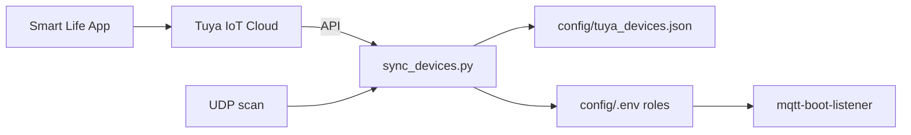

# Tuya Account Linking (Automation Server)

Link **all Tuya / Smart Life devices** from your app account to the automation server for local control (tinytuya).

## Overview



| Step | Where | Action |
|------|-------|--------|
| 1 | Browser | Create [Tuya IoT](https://iot.tuya.com) project, copy API keys |
| 2 | Browser | Link Smart Life app account (QR scan) |
| 3 | Automation server | Add keys to `config/.env`, verify API |
| 4 | Automation server | List & sync all devices |
| 5 | Automation server | Apply role (e.g. `media_server`) → `.env` |
| 6 | Automation server | Test local control, restart services |

---

## Step 1 — Tuya IoT Cloud project

1. Go to [https://iot.tuya.com](https://iot.tuya.com) and sign in.
2. **Cloud** → **Development** → **Create Cloud Project**.
3. Choose **Smart Home** (or General).
4. Pick a **data center** near you (e.g. Central Europe → `TUYA_API_REGION=eu`).
5. In the project: **API** → enable **IoT Core** / device management APIs.
6. **Overview** → **Authorization Key** → copy **Access ID** and **Access Secret**.

On the automation server, edit `config/.env`:

```bash
TUYA_ACCESS_ID=your_access_id
TUYA_ACCESS_SECRET=your_access_secret
TUYA_API_REGION=eu
```

---

## Step 2 — Link your app account

1. In the IoT project: **Devices** → **Link Tuya App Account** (or **All Devices** → **Link App Account**).
2. Open **Smart Life** or **Tuya Smart** on your phone (same account used when pairing devices).
3. Scan the QR code and confirm linking.
4. Confirm your devices (including the PCIe PC power card) appear in the project device list.

---

## Step 3 — Verify on automation server

```bash
cd ~/ServerBootShutdownManagemement   # or /opt/dell_server_management
bash scripts/tuya/tuya_link.sh step3
```

Expected: `OK — cloud API works, N device(s) linked`

If you see **no devices**, repeat Step 2. If **401/invalid sign**, check Access ID/Secret and data center region.

---

## Step 4 — List devices

```bash
bash scripts/tuya/tuya_link.sh step4
# or
/opt/dell_server_management/venv/bin/python3 scripts/tuya/sync_devices.py list
```

---

## Step 5 — Sync registry (cloud + LAN IPs)

```bash
bash scripts/tuya/tuya_link.sh step5
```

Writes [`config/tuya_devices.json`](../config/tuya_devices.json) (gitignored) with every device: `id`, `name`, `local_key`, `ip`, `version`, `product_id`.

The script also **UDP-scans** the LAN (~12s) to fill in IPs for local control. Devices must be on **2.4 GHz WiFi**.

---

## Step 6 — Apply role to media server

Auto-picks the PCIe power card using [`config/tuya_roles.yaml`](../config/tuya_roles.yaml):

```bash
bash scripts/tuya/tuya_link.sh step6
```

Or pick a specific device:

```bash
python3 scripts/tuya/sync_devices.py apply-role media_server --device-id bfd81b15990104836cxqma
```

Updates `MEDIA_SERVER_TUYA_*` in `config/.env`, then:

```bash
sudo systemctl restart mqtt-boot-listener mqtt-shutdown-listener
```

---

## Step 6b — All devices in `.env`

Writes every synced device to `config/.env` using indexed variables (sorted by name):

| Variable | Example |
|----------|---------|
| `TUYA_DEVICE_COUNT` | `12` |
| `TUYA_DEVICE_7_NAME` | `"media server"` |
| `TUYA_DEVICE_7_ID` | `bfd81b15990104836cxqma` |
| `TUYA_DEVICE_7_LOCAL_KEY` | `"..."` |
| `TUYA_DEVICE_7_IP` | `192.168.2.193` |
| `TUYA_DEVICE_7_VERSION` | `3.5` |
| `TUYA_DEVICE_7_PRODUCT_ID` | `rtbhfbuii82scjrp` |

```bash
bash scripts/tuya/tuya_link.sh step6b
# or after sync:
python3 scripts/tuya/sync_devices.py apply-env
```

Layout reference: [`config/tuya.env.example`](../config/tuya.env.example). Re-run after adding new Tuya devices.

---

## Step 7 — Test local API

```bash
bash scripts/tuya/tuya_link.sh step7
```

Should return JSON status from the device. If IP is empty, run **step5** again while the device is online.

---

## Quick path (after Steps 1–2 in browser)

```bash
bash scripts/tuya/tuya_link.sh all
```

---

## Files

| File | Purpose |
|------|---------|
| [`scripts/tuya/sync_devices.py`](../scripts/tuya/sync_devices.py) | CLI: `list`, `sync`, `apply-role`, `test`, `verify` |
| [`scripts/tuya/tuya_link.sh`](../scripts/tuya/tuya_link.sh) | Step-by-step wrapper |
| [`config/tuya_roles.yaml`](../config/tuya_roles.yaml) | Map devices → `.env` roles |
| [`config/tuya_devices.json`](../config/tuya_devices.json) | Synced registry (generated, not committed) |

---

## Adding more roles later

Edit `config/tuya_roles.yaml` with a new role and `env_mapping`, then:

```bash
python3 scripts/tuya/sync_devices.py sync
python3 scripts/tuya/sync_devices.py apply-role your_role_name
```

Reserved Node-RED flow numbers `840–849` can use MQTT topics fed from future Tuya publishers.

---

## Troubleshooting

### IoT Core subscription {#iot-core-subscription}

If verify/sync fails with **error 28841002** (*IoT Core service subscription has expired*):

1. Open [iot.tuya.com](https://iot.tuya.com) → **Cloud** → **Cloud Services**
2. Find **IoT Core** → **View Details**
3. Click **Extend Trial** (or activate the free trial on a new project)
4. Wait for approval (often minutes to 1–2 days)
5. If devices still missing after renewal: **Devices** → unlink and re-link your app account
6. Re-run on the automation server:

```bash
bash scripts/tuya/tuya_link.sh all
```

Until IoT Core is active, you can only LAN-scan (no local keys):

```bash
python3 scripts/tuya/sync_devices.py scan-lan
```

| Issue | Fix |
|-------|-----|
| No devices from API | Re-link app account (Step 2) |
| Empty `ip` in registry | Re-run `sync`; device must be on LAN WiFi |
| `apply-role` ambiguous | Use `--device-id` from `list` output |
| Local test fails | Wrong `version` (try 3.3 / 3.4 / 3.5 from sync output) |
| Sign error | `TUYA_API_REGION` must match IoT project data center |

Alternative interactive wizard: `python -m tinytuya wizard` (creates `devices.json` in home dir; our sync is preferred for this repo).
